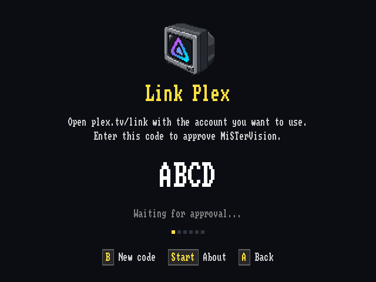

# MiSTerVision

<p align="center">
  
</p>

MiSTerVision is a Jellyfin and Plex client for CRT televisions on MiSTer FPGA. It supports movies, TV shows, live TV, music, photos, collections, and playlists through one interface.

My goal is a great media experience on CRTs. I test and use MiSTerVision on a MiSTer connected to a consumer 4:3 CRT television, not a PVM or an HD set. I have tested both server providers, including Jellyfin 12.


## Run on MiSTer

For a new installation, download `mistervision-vX.Y.Z-mister.zip` from the [latest release](https://github.com/trentnix/mistervision/releases/latest). Extract the ZIP and copy these files to the SD card. Make the launcher and both binaries executable if your filesystem requires it. If upgrading an existing installation manually, exit the application first and keep your configuration and state files.

| File | Destination |
| --- | --- |
| `mistervision/mistervision` | `/media/fat/mistervision/mistervision` |
| `mistervision/mplayer-arm` | `/media/fat/mistervision/mplayer-arm` |
| `Scripts/MiSTerVision.sh` | `/media/fat/Scripts/MiSTerVision.sh` |

Copy the remaining files from the ZIP’s `mistervision` directory into `/media/fat/mistervision/`. The archive includes examples, notices, and version information but no active configuration or saved state. Its `INSTALL.txt` has detailed instructions. To build from source, follow the [build guide](docs/GO_BUILD.md).

For Jellyfin on your local network, launch without a `server` section or legacy `jellyfin.conf`. MiSTerVision finds nearby servers, shows their names and addresses, and remembers the one you select. Approve Quick Connect to sign in. If the remembered server moves to a new address, MiSTerVision can find it again and ask you to confirm before reconnecting with your saved sign-in. See [discovery and troubleshooting](docs/GO_BROWSING.md#jellyfin-discovery).

For Plex, open **About → Connections → Plex**, approve the code at [plex.tv/link](https://plex.tv/link), and choose a server. For Plex Home accounts, choose a viewing profile and enter its PIN if required. The server picker shows the active viewer and reachable servers. Discovery checks the local network as well as account-provided addresses and prefers a reachable local connection. The successful selection is remembered. If its address stops working, MiSTerVision looks for the same server and asks before reconnecting at a new address. See [Plex discovery](docs/GO_PLEX.md#server-discovery).

For a remote Jellyfin server or an explicit Jellyfin or Plex address, copy [settings.example.json](settings.example.json) to `/media/fat/mistervision/settings.json` and set your server address. A minimal Jellyfin configuration is:

```json
{
  "server": {
    "provider": "jellyfin",
    "url": "http://your-jellyfin-server:8096"
  }
}
```

For Plex, use:

```json
{
  "server": {
    "provider": "plex",
    "url": "http://your-plex-server:32400"
  }
}
```

Launch **MiSTerVision** from the Scripts menu. For Jellyfin, approve the displayed Quick Connect code in a signed-in Jellyfin client. For Plex, enter the code at [plex.tv/link](https://plex.tv/link) using an account with access to your server. Plex account linking requires internet access.

The launcher filename must contain no spaces. Settings select one provider at a time. Sign-ins, playback choices, and artwork caches persist separately for each provider. See [configuration](docs/GO_CONFIGURATION.md) and [Plex limits](docs/GO_PLEX.md).

If moving from MiSTerFin CRT, follow the [rename instructions](docs/GO_BUILD.md#moving-from-misterfin-crt) before installing. This rename requires a manual installation.

## Updates

The client checks for the latest public release at startup. An available update appears beneath the carousel title. Use **Check updates** in About to check again.

1. While browsing, press Start on a controller or F1 on a keyboard to open **About**.
2. Select **View release** and review the changes.
3. Select **Install** and wait for completion. The app restarts automatically after a successful update.

Updates replace the application, matching MPlayer, and standard launcher together. Your settings, sign-in, playback preferences, cached artwork, and optional interlaced core are preserved. Back cancels during download or validation. During installation, wait for completion. Failed replacements restore the previous files. Interrupted replacements recover at the next startup.

Automatic updates require the standard installation paths above. Desktop and custom installations use manual installation. See [manual installation and recovery](docs/GO_BUILD.md#application-updates) for details.

## Progressive and interlaced output

The default uses MiSTer’s current display mode, normally 240p for NTSC or 288p for PAL. Interlaced output is optional: 480i for NTSC or 576i for PAL. I have tested 240p and 480i. Someone with PAL hardware will need to validate 288p and 576i output.

To enable interlaced output:

1. Exit MiSTerVision. Install the matching client and MPlayer builds described above.
2. Download the supported **InterlacedMenu.rbf v0.0.1** from the [display guide](docs/GO_DISPLAY.md#enable-or-disable-interlaced-output). Place it at `/media/fat/mistervision/InterlacedMenu.rbf`.
3. Set the `display` section in `/media/fat/mistervision/settings.json`:

```json
{
  "display": {
    "interlaced": true
  }
}
```

Launch **MiSTerVision** from the normal Scripts menu. The application switches to the interlaced core and restores the normal menu when you exit. Synchronization is automatic. The same launcher works for both modes.

To return to the progressive default, exit the application and set `display.interlaced` to `false`:

```json
{
  "display": {
    "interlaced": false
  }
}
```

Omitting the `display` section also restores the default on the next launch. Preserve other sections when changing this setting. The [display guide](docs/GO_DISPLAY.md) explains core verification, the scoped `MiSTer.ini` changes and backup, and hardware requirements.

## Controls

I test with an Xbox controller. The default layout follows MiSTer: B selects, plays, or pauses, and A goes back, cancels, or stops. Use the D-pad or left analog stick to navigate. During video or music playback, any direction shows or hides controls. Triggers seek, and shoulder buttons change music tracks.

Controller mappings are configurable in the `input` section of `settings.json`. For example, if you prefer A to select and B to go back, add this section while preserving your other settings:

```json
{
  "input": {
    "profiles": [
      {
        "match": "*Xbox*",
        "buttons": {
          "304": "open",
          "305": "back"
        }
      }
    ]
  }
}
```

The numbers are Linux input event codes. For a standard Xbox mapping, `304` is A (`BTN_SOUTH`) and `305` is B (`BTN_EAST`). Other controllers or drivers can report different codes. Use an input inspector such as `evtest` to read the code when you press a button. See [finding device names and button codes](docs/GO_INPUT.md#finding-device-names-and-button-codes).

The `match` pattern must match the controller's Linux device name and is case-sensitive. Restart MiSTerVision after editing. Unspecified bindings keep their defaults, and on-screen hints follow the configured mappings. The [controller configuration guide](docs/GO_INPUT.md) explains how to find device names and button codes, remap axes, and customize button labels. These profiles configure hardware input on MiSTer. Ghostty uses terminal keyboard controls.

The [playback guide](docs/GO_PLAYBACK.md#playback-controls) lists controller and keyboard controls. [About](docs/GO_BROWSING.md#about-and-updates) shows the installed version and provides [updates](#updates).

To control playback from another Jellyfin client, select **MiSTerVision** as the playback device. Remote play, queues, pause/resume, seeking, shuffle, and repeat are supported. See [remote control](docs/GO_REMOTE.md).

## Screenshots

The carousel capture shows the shared renderer in the desktop harness. The other browsing and playback captures are from MiSTer. Setup previews use example connection details.

| Continue Watching | Video controls |
| --- | --- |
|  |  |

| Jellyfin Quick Connect | Plex account linking |
| --- | --- |
|  |  |

Also see [setup help](docs/images/screenshots/setup-needed.png), the [movie library](docs/images/screenshots/movies-list.png) and [movie details](docs/images/screenshots/movie-info.png).

## Configuration

Connection and application settings live in **`settings.json`**, normally `/media/fat/mistervision/settings.json` on MiSTer. Both providers use `server.provider`, `server.url`, `server.insecure_tls`, and `server.transcode`. For a new installation, copy [settings.example.json](settings.example.json). Existing installations can use the migration command below. Omitted optional fields use defaults. Restart after changing settings.

```json
{
  "server": {
    "provider": "jellyfin",
    "url": "http://your-jellyfin-server:8096"
  },
  "ui": {
    "title": "MiSTerVision",
    "show_collections": true,
    "show_playlists": true,
    "navigation_sounds": {
      "enabled": false
    }
  },
  "background": {
    "image": "background.png"
  },
  "display": {
    "interlaced": false
  }
}
```

| Setting | Defaults and options | Guide |
| --- | --- | --- |
| `server` | Provider: `jellyfin`. URL required when the section exists. TLS verified. Transcode limits: 720×576 at 12 Mbps. | [Connection](docs/GO_CONFIGURATION.md#server-connection) |
| `ui.title` | Heading: `MiSTerVision`. An explicit empty `title` hides it. Long titles are truncated. | [Title](docs/GO_CONFIGURATION.md#browsing-title) |
| `ui.show_collections`, `ui.show_playlists` | Both `true`. Show nonempty categories. Set either to `false` to hide its card. | [Carousel](docs/GO_CONFIGURATION.md#carousel-categories) |
| `ui.navigation_sounds` | `enabled: true`, `volume: 10` out of 100. False or volume zero silences navigation sounds. | [Sounds](docs/GO_CONFIGURATION.md#navigation-sounds) |
| `background` | Generated carousel mosaics and item artwork on lists. `image` selects one custom background. | [Background](docs/GO_CONFIGURATION.md#browsing-background) |
| `display` | `interlaced: false`. Keep the current display, normally progressive. | [Display](docs/GO_DISPLAY.md) |
| `input` | Built-in controller mappings and button labels. Profiles override matching devices. | [Input](docs/GO_INPUT.md) |
| `music_visuals` | Music playback appearance only. `default_background: "Starfield"`, `show_audio_meters: true`. Missing optional Toasty sprites are omitted. | [Music visuals](docs/GO_MUSIC.md) |
| `diagnostics` | Off. Legacy `DEBUGLOG` applies only without a `server` section. Path: `debug.log`. Limit: 1 MiB per file. | [Diagnostics](docs/GO_DIAGNOSTICS.md) |

Existing installations retain `jellyfin.conf` fallback when `server` is absent. Separate legacy JSON files are read when `settings.json` is absent. To consolidate connection and application settings on MiSTer:

```bash
/media/fat/mistervision/mistervision -migrate-settings -config /media/fat/mistervision/jellyfin.conf
```

Migration preserves `jellyfin.conf` and legacy JSON files. If `settings.json` exists, migration adds the connection section after saving a private `settings.json.before-server` backup. Existing server sections, backups, and concurrent edits are never overwritten. Once `server` exists, all connection settings come from JSON. See [configuration paths, migration, and recovery](docs/GO_CONFIGURATION.md).

### Browsing background

To use one custom image on the carousel and browsing lists, set `background.image` in `settings.json`:

```json
{
  "background": {
    "image": "background.png"
  }
}
```

Place the image in the same directory, or use an absolute path. PNG and JPEG are supported, up to 4 MiB and 2048 pixels in either dimension. A 4:3 image fits best. The client crops and dims it to keep the interface readable. Restart to apply changes. An omitted or empty `image` keeps the normal artwork.

The client checks the file contents, not its extension. A video, text file, unsupported image format, or corrupt image is rejected. Missing or invalid image files fall back to the normal artwork with a brief on-screen notice. With diagnostics enabled, the fallback also records a `configuration.fallback` event. Startup continues.

### Sounds and caches

To turn off navigation sounds, set `ui.navigation_sounds`:

```json
{
  "ui": {
    "navigation_sounds": {
      "enabled": false
    }
  }
}
```

Sound settings affect browsing feedback only. They do not change music or video volume.

`MISTERVISION_CACHE_ROOT` changes where artwork and carousel collages are cached. The default root is `/media/fat` on MiSTer, `/tmp/mistervision-cache` in the Ghostty harness, and the user’s cache directory (usually `~/.cache`) for direct desktop runs. To keep the Ghostty cache across reboots, set `MISTERVISION_CACHE_ROOT="$HOME/.cache"` before launching the harness. The client stores caches under `mistervision` within that directory. See [artwork caching](docs/GO_BROWSING.md#persistent-artwork-cache) for details.

You can keep multiple Jellyfin and Plex accounts signed in. Add named profiles to `connections.profiles`, then use **About → Connections → Use existing connection** to switch. Only the active connection accepts remote commands. See [multiple connections](docs/GO_CONFIGURATION.md#multiple-connections) for the configuration example and startup behavior.

## Local development and testing

I use the Ghostty harness on Linux to develop and test the interface without MiSTer hardware. It also helps verify that the architecture supports different display pipelines while reusing the same UI and application logic. From the repository directory, run the browsing demo:

```bash
python3 tools/ghostty/ghostty_harness.py --demo --ntsc
```

The harness builds the client automatically. The demo uses mock data and does not play media. See the [development harness guide](tools/ghostty/README.md) for dependencies, copyable Jellyfin discovery and Plex connection commands, separate configuration profiles, and playback inside Ghostty.

## Server support

Jellyfin and Plex share browsing, controls, music visuals, picture modes, and the photo viewer. Each adapter handles its own sign-in, media queries, and streaming. Playback requires a server that can supply the supported formats.

Jellyfin supports remote control from other Jellyfin clients and local-network discovery. Plex supports linked-account access, account and GDM discovery, and local DVR live TV with alternate audio when available. Both providers can recover remembered server addresses after confirmation.

Plex Home profiles are supported, including avatars, PIN entry, remembered viewers, and **Switch profile** in About. See [profile controls and startup behavior](docs/GO_PLEX.md#plex-home-profiles). Relay connections, Plex remote control, multi-file movies, and Plex's free online TV are not implemented. See [Plex playback and limits](docs/GO_PLEX.md).

## Deferred work

- **Broader controller support:** Testing more controllers, recognizing controller families, and showing their button labels automatically are potential future improvements. Other controllers may need a custom input profile today.
- **PAL 288p/576i and direct MiSTer YPbPr validation:** Someone with suitable hardware will need to test these output paths. I do not have that hardware. My tested setup uses MiSTer configured for RGB through its 9-pin output and a Retrovision YPbPr cable to a consumer 4:3 CRT.
- **Zaparoo DDR integration:** Deferred until I have a way to test it. Zaparoo is not required for the supported interlaced output.
- **MiSTer background-music hardware validation:** Suspension and restoration are implemented and covered by automated tests. Testing with the actual add-on is deferred because I do not use it. This is separate from music played through Jellyfin or Plex.

## More information

See the [documentation index](docs/README.md) for all guides and current limits.

- [Browsing, Continue Watching, and artwork caches](docs/GO_BROWSING.md)
- [Playback and controls](docs/GO_PLAYBACK.md)
- [Subtitles, audio tracks, and picture modes](docs/GO_PLAYBACK.md#video-options)
- [Builds and tests](docs/GO_BUILD.md)
- [Rendering architecture](docs/GO_RENDERING.md)

## Origins and license

I started this project as MiSTerFin CRT, a Go port of [MiSTerFin](https://github.com/puddingstudio/MiSTerFin) by Pudding Studio, including my [C changes](https://github.com/trentnix/MiSTerFin). I maintain it independently. It remains heavily based on MiSTerFin, an excellent project.

Original MiSTerFin material is copyright © 2026 Pudding Studio. My additions and modifications are copyright © 2026 trentnix. I distribute the application under [CC BY-NC 4.0](LICENSE), except for components covered by [separate licenses](docs/THIRD_PARTY.md), including the GPL-licensed MPlayer.
