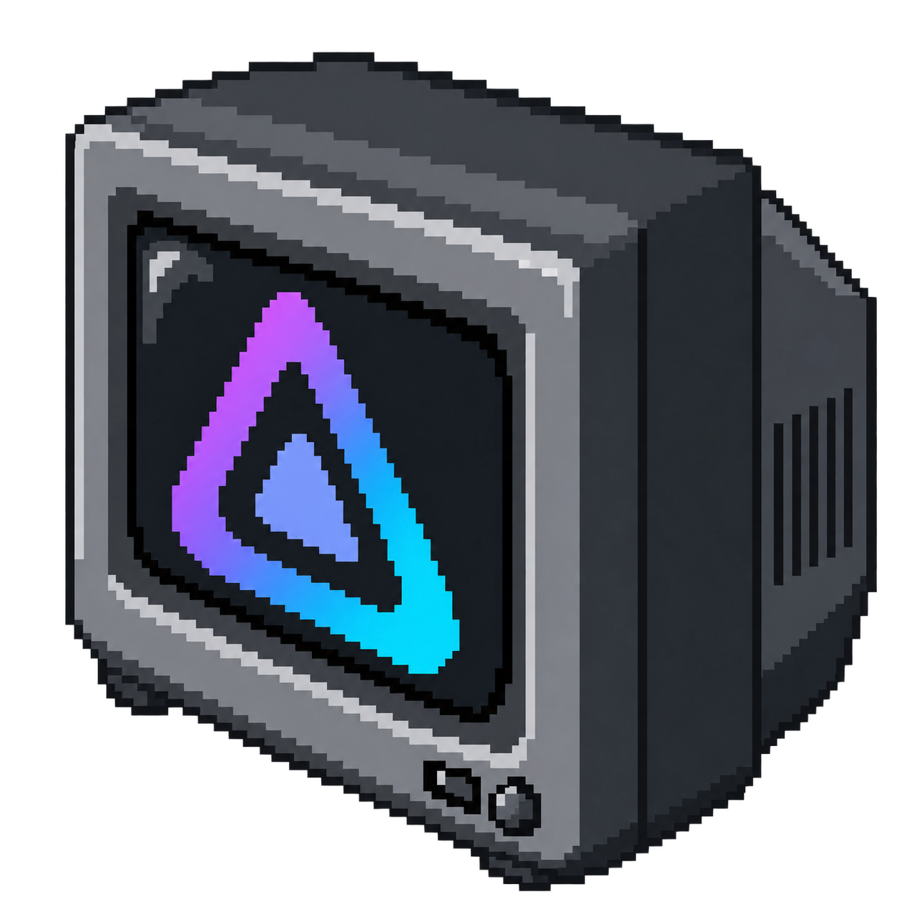
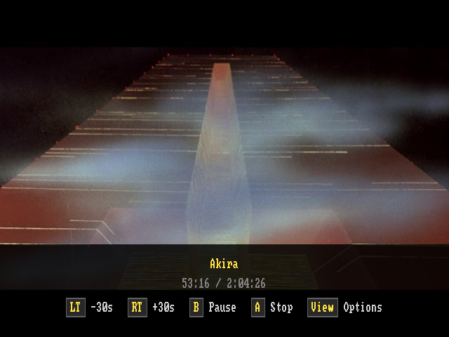
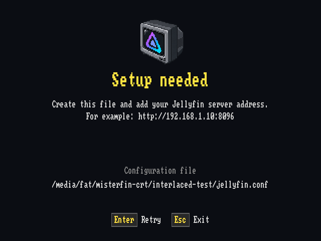
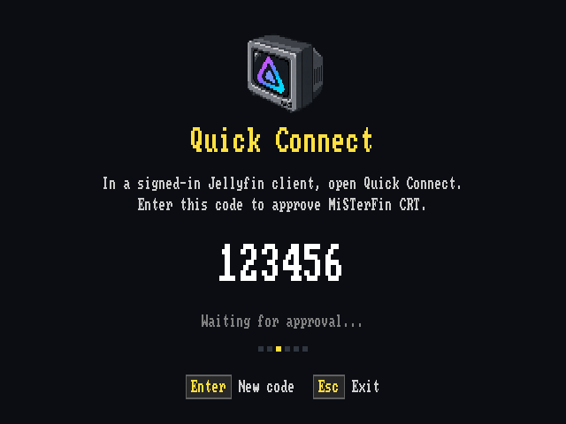

# MiSTerFin CRT



MiSTerFin CRT is a Jellyfin client for MiSTer FPGA, designed for CRT televisions. It supports movies, TV, live TV, music, and photos.

I’m continuing MiSTerFin’s focus on a great Jellyfin experience on CRTs. I test and use it on a MiSTer connected to a consumer 4:3 CRT television, not a PVM or an HD set.


## Run on MiSTer

Installation is manual. Build the client using the [build guide](docs/GO_BUILD.md) and its matching MPlayer using the [player build instructions](docs/GO_PLAYBACK.md#mister-use-and-remaining-work).

Copy these files to the SD card and make them executable:

| File | Destination |
| --- | --- |
| `build/misterfin-crt-arm` | `/media/fat/misterfin-crt/misterfin-crt` |
| `build/misterfin-crt-mplayer-arm` | `/media/fat/misterfin-crt/mplayer-arm` |
| [`tools/misterfin-crt.sh`](tools/misterfin-crt.sh) | `/media/fat/Scripts/MiSTerFin-CRT.sh` |

Create `/media/fat/misterfin-crt/jellyfin.conf` containing your server URL:

```text
http://your-jellyfin-server:8096
```

Launch **MiSTerFin-CRT** from the Scripts menu. Approve the displayed Quick Connect code in Jellyfin. The launcher filename must contain no spaces. Login, playback choices, and artwork caches persist on the SD card.

## Controls

Use the D-pad to navigate and follow the on-screen button hints to select or go back. During video or music playback, any direction shows or hides controls. Triggers seek, and shoulder buttons change music tracks.

The [playback guide](docs/GO_PLAYBACK.md#playback-controls) lists controller and keyboard controls. Press START/Menu on a controller or F1 on a keyboard while browsing to open [About](docs/GO_ABOUT.md). About shows the installed version and checks for public releases. The Update action currently displays "Not implemented yet."

## Screenshots

Browsing and playback captures are from MiSTer. Setup previews use the same renderer with example connection details.

| Continue Watching | Video controls |
| --- | --- |
|  |  |

| Setup help | Quick Connect |
| --- | --- |
|  |  |

Also see the [movie library](docs/images/screenshots/movies-list.png) and [movie details](docs/images/screenshots/movie-info.png).

## Configuration

To change video conversion limits, add a line such as `640x480@8000000` to `jellyfin.conf` and restart. The values are maximum width, maximum height, and bitrate in bits per second. The default is `720x576@12000000`. The profile applies to recorded video and Live TV. See [transcode configuration](docs/GO_PLAYBACK.md#transcode-configuration).

Optional configuration files live beside `jellyfin.conf`. On MiSTer, that directory is `/media/fat/misterfin-crt`. Copy an example below, rename it, and edit the copy. Restart the application after changing settings. Missing files use the defaults.

| File | Settings | Example and guide |
| --- | --- | --- |
| `diagnostics.json` | Optional request and playback diagnostics, log path, and size limit. Disabled by default. | [Example](diagnostics.example.json) · [Guide](docs/GO_DIAGNOSTICS.md) |
| `display.json` | Optional true interlaced CRT output, applied on launch. Requires the standalone core and matching player. | [Example](display.example.json) · [Guide](docs/GO_DISPLAY.md) |
| `sounds.json` | Navigation and selection sounds. Enabled by default at volume 10 out of 100. | [Example](sounds.example.json) · [Guide](docs/GO_SOUNDS.md) |
| `input.json` | Controller bindings and button labels. | [Example](input.json.example) · [Guide](docs/GO_INPUT.md) |
| `music.json` | Music backgrounds, custom images and animations, and stereo level meters. | [Example](music.example.json) · [Guide](docs/GO_MUSIC.md) |

To turn off navigation sounds, create `sounds.json` containing:

```json
{"enabled": false}
```

Sound settings affect browsing feedback only. They do not change music or video volume. Each guide also describes how to select a different configuration path.

`MISTERFIN_CACHE_ROOT` changes where artwork and carousel collages are cached. Go stores them under `misterfin-crt` within that directory. See [artwork caching](docs/GO_BROWSING.md#persistent-artwork-cache) for details.

## Local development and testing

I use the Ghostty harness on Linux to develop and test the interface without MiSTer hardware. It also helps verify that the architecture supports different display pipelines while reusing the same UI and application logic. From the repository directory, run the browsing demo:

```bash
python3 tools/ghostty/ghostty_harness.py --demo --ntsc
```

The harness builds the client automatically. See the [development harness guide](tools/ghostty/README.md) for dependencies, connecting to Jellyfin, and testing playback.

## More information

- [Browsing, Continue Watching, and artwork caches](docs/GO_BROWSING.md)
- [Playback and controls](docs/GO_PLAYBACK.md)
- [Subtitles, audio tracks, and picture modes](docs/GO_TRACKS.md)
- [Builds and tests](docs/GO_BUILD.md)
- [Rendering architecture](docs/GO_RENDERING.md)

## Origins and license

I started MiSTerFin CRT as a Go port of [MiSTerFin](https://github.com/puddingstudio/MiSTerFin) by Pudding Studio, including my [C changes](https://github.com/trentnix/MiSTerFin). I maintain it independently. It remains heavily based on MiSTerFin, an excellent project.

Original MiSTerFin material is copyright © 2026 Pudding Studio. My additions and modifications are copyright © 2026 trentnix. I distribute the application under [CC BY-NC 4.0](LICENSE), except for components covered by [separate licenses](docs/THIRD_PARTY.md), including the GPL-licensed MPlayer.
