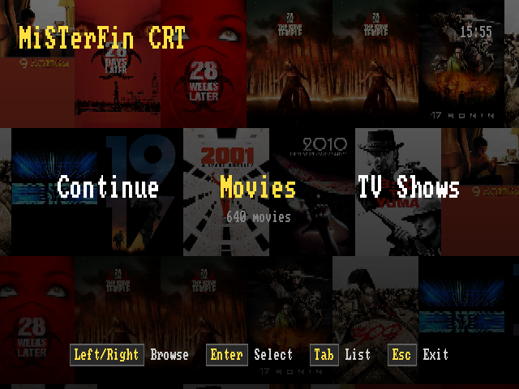
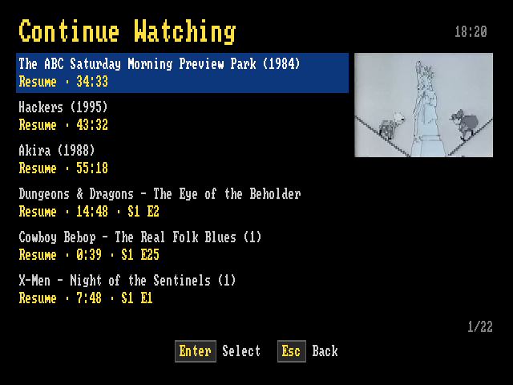
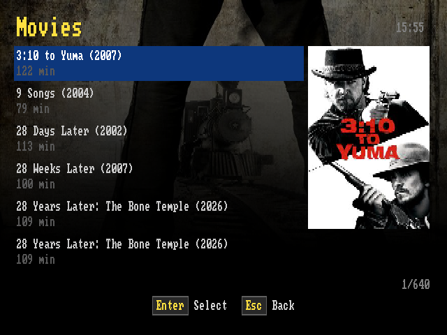
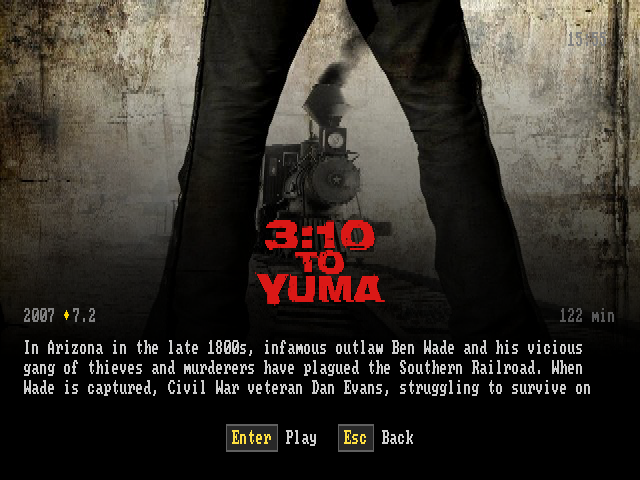

# MiSTerFin

<p align="center"></p>

A [Jellyfin](https://jellyfin.org) client for the [MiSTer FPGA](https://misterfpga.org) platform. Browse your Movies/TV/Music library, see cover art and overview, and play back on a CRT — video is server-side transcoded and letterboxed to PAL or NTSC, with client-side subtitles, full pause/seek/resume support, and a proper music player with a now-playing screen. Works with whatever analog output your MiSTer is already set up for (SCART, composite, component, ...) — MiSTerFin just writes to the standard framebuffer, same as any other MiSTer app.

Having trouble getting it onto a CRT? Check [docs/DISPLAY_COMPATIBILITY.md](docs/DISPLAY_COMPATIBILITY.md) for confirmed working display/cable/`MiSTer.ini` combinations.

The UI is currently tuned for PAL/NTSC-resolution CRT output (288p/240p) — it isn't optimized for higher resolutions yet (that may come later). That said, a regular multisync VGA CRT monitor can still be made to show a genuine 240p picture via an `MiSTer.ini` trick documented in the compatibility guide above — in effect, "simulating" a CRT TV's picture on an ordinary computer monitor, for a PVM/BVM-like look without needing broadcast-video hardware.

---

## Contents

- [Screenshots](#screenshots)
- [Features](#features)
- [Scope (v1)](#scope)
- [Requirements](#requirements)
- [Building from Source](#building-from-source)
  - [Running it on a desktop](#running-on-desktop)
- [Installation](#installation)
- [Configuring `jellyfin.conf`](#configuring-jellyfin-conf)
  - [Using Quick Connect](#using-quick-connect)
  - [Using an API key instead](#using-api-key)
- [Controls](#controls)
  - [Browser](#browser)
  - [About screen (START)](#about-screen)
  - [Info screen (movies/episodes)](#info-screen)
  - [During video playback](#during-playback)
  - [Track picker (SELECT during video playback)](#track-picker)
  - [Now playing (music)](#now-playing)
- [Known limitations](#known-limitations)
- [Changelog](#changelog)
  - [v1.0.1](#v1-0-1) · [v1.0.0](#v1-0-0) · [v0.9.9](#v0-9-9) · [v0.9.8](#v0-9-8) · [v0.9.7](#v0-9-7) · [v0.9.6](#v0-9-6) · [v0.9.5](#v0-9-5) · [v0.9.4](#v0-9-4) · [v0.9.3](#v0-9-3) · [v0.9.2](#v0-9-2) · [v0.9.1](#v0-9-1) · [v0.9](#v0-9)
- [Credits](#credits)
- [Thanks](#thanks)
- [Licence](#licence)

---

## <a id="screenshots"></a>Screenshots

All captured in-app via the [SELECT+START screenshot combo](#controls), straight off a real MiSTer's framebuffer — no emulator, no upscaling.

**Browser**

| | | |
|:---:|:---:|:---:|
| <br>Home carousel | <br>Update-available hint | <br>Continue Watching |
| <br>Movies (list view) | <br>TV shows (root) | <br>Seasons (scrolling title) |
| <br>Episode list | <br>Music: artists (root) | <br>Music: albums |
| <br>Music: tracks | | |

**Info screen**

| | |
|:---:|:---:|
| <br>Movie info | <br>Episode info |

**Video playback**

| | | |
|:---:|:---:|:---:|
| <br>Letterboxed (2.20:1 source) | <br>Full 4:3 (no letterboxing) | <br>Seek overlay |
| <br>Pause menu | <br>Subtitle picker | <br>Audio track picker |
| <br>Picture modes (wide titles) | <br>Admin message from the Jellyfin dashboard | |

**Music**

| | | |
|:---:|:---:|:---:|
| <br>Now playing (VU meters) | <br>Rain | <br>Nebula visualizer |
| <br>Now Spinning | <br>Tunnel | <br>Toasty Squadron |

**About**

| | |
|:---:|:---:|
| <br>About screen | <br>What's new (before an update installs) |

**Setup and errors**

| | | |
|:---:|:---:|:---:|
| <br>Quick Connect code | <br>Can't connect to server | <br>Quick Connect failed |
| <br>Username not found | <br>jellyfin.conf missing | <br>HTTPS self-signed hint |

## <a id="features"></a>Features

- **Quick Connect sign-in** — no API key, no admin dashboard, no password typed on a gamepad. First launch shows a code; approve it from any device already signed into Jellyfin and the login is saved. A revoked login is detected and re-requested automatically. API keys still work for existing setups
- **Continue Watching and Next Up** appear as the first two cards on the home screen, ahead of the libraries, and only when they have something in them. Episodes there show which series and which episode they are, since a row called "Episode 03" out of context identifies nothing
- **Home screen** is a horizontal library carousel — name + item count per library, the active one centered, with a dimmed cover-art mosaic from that library filling the background. Every library gets its own slot along the strip (extras simply run off-screen rather than being hidden), and LEFT/RIGHT slides between them with the background fading through black. SELECT swaps to a classic list view instead, if you prefer that; either way, the selected library is remembered when you back out of one. B opens an exit-confirm dialog instead of quitting immediately, so a stray press can't silently close the app
- **Browsing within a library** (movies/series/albums/episodes/tracks) uses a list with cover art per item, watched/resume badges, a live clock, and a scrolling marquee for titles too long to fit (e.g. "Artist / Album", "Series / Season"). Albums show year + track count, artists show album count, and series show season + episode count
- **Info screen** with cover art, description, year, and status
- **Video playback** is server-side transcoded with correct letterbox/pillarbox scaling for any source aspect ratio
- **True interlaced output (576i/480i)** is possible on a CRT TV — smoother, broadcast-style motion instead of the scanline look, and genuinely tear-free thanks to a hardware page-flip technique. It runs on a standalone core that doesn't touch any MiSTer system files, switched live with a button combo: see the [step-by-step guide](docs/DISPLAY_COMPATIBILITY.md#interlaced-output), confirmed working over SCART and Component/YPbPr, both PAL and NTSC
- **Pause menu** with a live progress bar, VSync ON/OFF toggle, resume/stop
- **Subtitles** are rendered client-side (instant toggle/switch, no re-buffering) for text-based tracks, with a picker menu and live sync fine-tuning; image-based tracks (PGS/VobSub — no text to hand back client-side) fall back to a server-side burn-in automatically instead of silently failing to show. ASS/SSA subtitles are cleaned up on the way in — inline override codes like `{\an8}` and `{\i1}` are stripped rather than drawn on screen as literal text
- **Alternate audio tracks** — a second tab in the same SELECT menu lists every audio stream (language, codec, channel count, and whatever else the server puts in its display title, so a commentary track is distinguishable from the main mix). Switching restarts the stream at the current position, since the server transcodes one chosen track into what it sends
- **Picture modes for wide titles** — a third tab in the same SELECT menu, shown only for wide sources: **Original** (as encoded), **Zoom 4:3** (crops in to fill the screen — for 4:3 content encoded inside a 16:9 file with baked-in black bars), and **Stretch** (fills the screen by stretching vertically, nothing cropped). Applies instantly at the current position
- **Music library**: browse Artists → Albums → Tracks, direct-play audio (no server transcode needed for a plain FLAC/MP3 file), a now-playing screen with a live clock, cover art (falls back to the album's cover for a track with no embedded art of its own), a real audio-reactive VU meter pair (reads mplayer's own live PCM export, not a decorative animation), a SELECT-cycled background effect — starfield, rain, **Nebula** (our own audio-reactive plasma visualizer, inspired by Ryan Geiss's classic feedback visualizer), **Now Spinning** (the cover as a spinning CD over a reactive graphic-EQ bar), **Tunnel** (a low-poly 3D wireframe flythrough that warps and accelerates with the music, with wall panels that light up on the beat), or a faithful port of [MiSTer-Toasty-Squadron](https://github.com/puddingstudio/MiSTer-Toasty-Squadron)'s own flying-toaster screensaver (same flight paths, sizes, and moon, right down to its biggest sprites flying over the cover art); Nebula, Now Spinning, Tunnel and Toasty use an immersive layout — just an enlarged centered cover over the effect — seek within a track, and prev/next-track navigation that auto-advances at the end of each track
- **UI sounds** — a navigation click and a confirm chime, mixed in-process so they land on the keypress rather than a beat after it. The MiSTer routes Linux audio through a single non-shareable FPGA pipe, so the sounds step aside while a film or track is playing and return when it ends; `touch /media/fat/misterfin/no-sfx` disables them entirely
- **Sync**: resume position and watched status are read from and reported back to Jellyfin, so they stay in sync with your other Jellyfin clients
- **About screen** with a GitHub-releases update check and in-app update — pressing update first shows the release's own notes on a scrollable what's-new screen, and the install (applied on next launch) sits behind one more confirm there; the same animated starfield background also shows on the setup screen if `jellyfin.conf` is missing/misconfigured

## <a id="scope"></a>Scope (v1)

- Movies, TV shows, Music, and Music Videos — no photo libraries
- Server-side transcode for video (the MiSTer's ARM Cortex-A9 can't decode arbitrary HEVC/4K sources locally) to a CRT-sized stream, then letterboxed/pillarboxed client-side to exactly fill the PAL/NTSC frame
- Audio plays back directly (`static=true`, no server transcode) — this mplayer build decodes FLAC/MP3 natively, and there's no letterboxing concern for audio the way there is for video

<br>

<p align="center"></p>

<br>

---

## <a id="requirements"></a>Requirements

- MiSTer FPGA (standard Linux image, standard `menu.rbf` — no special core required for the default progressive-scan output; true interlaced output needs an additional community core, see the [display compatibility guide](docs/DISPLAY_COMPATIBILITY.md#interlaced-output))
- A way to get the picture onto a CRT — most confirmed setups use the official Analog I/O board; see the [display compatibility guide](docs/DISPLAY_COMPATIBILITY.md) for confirmed combos and `MiSTer.ini` settings
- A reachable Jellyfin server, and a way to sign in — Quick Connect (enabled by default on most installs, no API key or admin access needed) or an API key
- `curl` on the MiSTer (included in the standard MiSTer Linux image)

Grab the latest release zip from the [Releases](../../releases) page and skip straight to **Installation** below, or build from source if you'd rather. Everything needed to run MiSTerFin (including its own `mplayer-arm`) is built from this repo either way; you don't need a separate mplayer install or any other MiSTer app already set up.

Prefer updating through a MiSTer Downloader? There's also a community-maintained [MiSTerFin database](https://github.com/theypsilon/MultiDatabases_MiSTer/tree/main/misterfin) for [Downloader](https://github.com/MiSTer-devel/Downloader_MiSTer) — install it once and future updates get picked up automatically alongside your other MiSTer Downloader-managed content, as an alternative to the in-app updater above. [MiSTer Companion](https://github.com/Anime0t4ku/mister-companion) builds on that same database to offer one-click install/update/uninstall for MiSTerFin from its own GUI.

Video output goes through the standard MiSTer framebuffer path (`mplayer -vo fbdev:/dev/fb0`) and works on any menu core — MiSTerFin's patched mplayer waits for vsync before each frame write, so playback is tear-free in normal use. If the [Zaparoo Project](https://zaparoo.org)'s dual-mode menu core (`menu_zaparoo.rbf`) is installed as your menu core, MiSTerFin detects it and uses its DDR native-video path during playback instead — no configuration either way.

---

## <a id="building-from-source"></a>Building from Source

Requires [Zig](https://ziglang.org) (for ARM cross-compilation of the app itself), [Docker](https://www.docker.com) (only for building `mplayer-arm`, MiSTerFin's own fbdev-patched mplayer — a one-time step, not needed again unless you want to rebuild it), and `sshpass` (only for `make deploy`, which copies everything over SSH — skip it and copy files manually if you don't want it installed).

```bash
# 1. Build mplayer-arm (one-time; needs Docker)
cd docker
docker build -t misterfin-mplayer .
docker run --name misterfin-mplayer-build misterfin-mplayer
docker cp misterfin-mplayer-build:/build/mplayer-arm ../mplayer-arm
docker rm misterfin-mplayer-build
cd ..

# 2. Build the app itself
make arm

# 3. Deploy everything over SSH (uses the standard MiSTer root password)
make deploy
```

`make deploy` copies `misterfin-arm`, `mplayer-arm`, `assets/font/`, `assets/subfont/`, `assets/font2x/`, `assets/subfont2x/`, `assets/toasty/`, `assets/about.png`, and the launcher script to the right places on the MiSTer — see the `deploy` target in `Makefile` if you want to do it manually instead.

`make deploy` targets `mister.local` by default. This works as-is if your MiSTer is visible under that hostname on your network (its stock image advertises itself via mDNS) and you haven't changed the default `root` login. If `mister.local` doesn't resolve for you, override it with your MiSTer's IP instead: `make deploy MISTER_HOST=192.168.x.x`.

If you'd rather not build `mplayer-arm` yourself, MPlayer 1.5 built with `--enable-fbdev --enable-alsa` and the vsync patch in `docker/vo_fbdev.c` applied will work — that's exactly what `docker/build-mplayer.sh` automates.

### <a id="running-on-desktop"></a>Running it on a desktop

`tools/run-local.sh` runs the real app on an ordinary Linux box, so UI and API work doesn't need a flash-and-look cycle for every change. There's no `/dev/fb0` to draw into, so the app is pointed at a plain malloc'd buffer of the same size and reads keys from the terminal instead of `/dev/input/eventN`; every frame is dumped and converted to a PNG by `tools/raw_to_png.py` (stdlib `zlib` only — no image library needed).

```bash
tools/run-local.sh                            # interactive: arrows, Enter, Esc, Tab, q to quit
tools/run-local.sh -k "right,right,a"         # scripted, then screenshot the result
tools/run-local.sh -k "down:200,a:1500" -o shot.png
tools/run-local.sh --ntsc -k "a"              # 240-line NTSC geometry instead of PAL's 288
```

Ghostty can display the framebuffer as a smooth, interactive 4:3 image through its Kitty graphics support. The helper builds the host binary, passes keyboard input directly to MiSTerFin and writes program output to `/tmp/misterfin-ghostty.log` so it cannot corrupt the image:

```bash
python3 tools/ghostty/ghostty_harness.py          # PAL
python3 tools/ghostty/ghostty_harness.py --ntsc   # NTSC
```

See [`tools/ghostty/README.md`](tools/ghostty/README.md) for controls and additional options.

It needs a `./jellyfin.conf` in the repo root pointing at a real server (gitignored, same file `--preview-browse` expects). **Video playback is not usable this way** — mplayer writes straight into a real framebuffer, which a malloc'd buffer can't stand in for; everything else (browsing, info screens, music metadata, menus, auth) works normally.

`MISTERFIN_INPUT_DEBUG=1` works on real hardware too, not just on a desktop: it prints every incoming input event with its device, raw code and what it mapped to (or why it was dropped) to stderr, so run it over SSH rather than from the Scripts menu. MiSTer's input routing is genuinely unusual — it grabs directly-wired USB pads exclusively and re-emits them on a synthetic "MiSTer virtual input" device — so if a button isn't doing anything, this says whether it's arriving at all and under which code.

The underlying switches are plain environment variables if you'd rather drive them yourself: `MISTERFIN_FB=640x288` picks the headless buffer size, `MISTERFIN_FRAME_OUT=<path>` dumps each frame, `MISTERFIN_CACHE_ROOT=<path>` selects the persistent artwork cache, `MISTERFIN_STDIN=1` reads the terminal, and `MISTERFIN_KEYS="right,a:800"` plays a scripted sequence (`MISTERFIN_KEYS_HOLD=1` to stay running afterwards instead of quitting).

---

## <a id="installation"></a>Installation

1. Copy these files (from a downloaded release zip, or your own build) to `/media/fat/misterfin/` on your MiSTer:

   ```
   misterfin-arm
   mplayer-arm
   font/
   subfont/
   font2x/
   subfont2x/
   toasty/
   about.png
   jellyfin.conf      (see below)
   ```

2. Copy the launcher script:

   ```
   tools/MiSTerFin.sh  →  /media/fat/Scripts/MiSTerFin.sh
   ```

3. Launch from the MiSTer **Scripts** menu.

(`make deploy` does steps 1–2 for you, minus `jellyfin.conf` itself.)

---

## <a id="configuring-jellyfin-conf"></a>Configuring `jellyfin.conf`

Create `/media/fat/misterfin/jellyfin.conf`. The only line you actually need is your server:

```
http://<your-jellyfin-ip>:8096
PAL
```

**TV mode** is `PAL` or `NTSC`, optional, defaults to `PAL`. It's recognised wherever it appears in the file, so you don't have to pad the lines above it.

**Transcode profile** is optional and you normally shouldn't touch it. The default (`720x576@12000000` — full standard-definition source resolution, for PAL and NTSC alike; the video is scaled to exactly fit whichever mode your MiSTer outputs) is the tuned, known-good value and is what MiSTerFin uses if you leave this out — measured on hardware across widescreen and 4:3 content with no dropped frames, no A/V drift, and plenty of CPU headroom left. The setting exists as a tuning knob, not something a normal setup needs to set.

If you do want to change it, it's recognised wherever it appears in the file — `WxH` or `WxH@BITRATE`, e.g. `480x270@8000000`. It sets what the server is asked to transcode video down to before mplayer scales it to fill the screen. The active profile is shown on the pause screen so you can confirm which one is in effect.

The main reason to set it is a constrained network: the default asks the server for about 12 Mbps (~1.5 MB/s — trivial over the wired connection MiSTers normally use, but potentially too much for a weak WiFi bridge). If playback stutters or audio drifts out of sync, set `480x270@8000000` — the original default from earlier releases, which also selects the exact scaling path those releases used.

**Troubleshooting a bug?** Add a line containing just `DEBUGLOG` (also recognised wherever it appears) and MiSTerFin writes `/media/fat/misterfin/debug.log` — one line per server request (method, endpoint, ok/fail, timing), plus one-shot startup/playback diagnostics (framebuffer geometry, input devices found, the relevant `MiSTer.ini` display settings, which menu core/DDR path is active, the update check result, and the transcode profile used each time something plays), truncated fresh on every launch. Off by default, and never includes your server URL, credentials, anything from a request's query string, or what's in your library (no titles/ids), so it's safe to attach to a bug report as-is. See `jellyfin.conf.example` for the full details.

**HTTPS with a self-signed certificate?** MiSTerFin verifies your server's TLS certificate by default. If your server is `https://` with a self-signed cert, add a line containing just `INSECURE_TLS` to skip verification. A plain `http://` server (the usual setup) doesn't use TLS and ignores this.

### <a id="using-quick-connect"></a>Using Quick Connect

The default and preferred way to sign in — nothing to type on the config side beyond the server URL above.

On first launch MiSTerFin shows a **Quick Connect** code. Open Jellyfin on any device where you're already signed in, go to your user menu → Quick Connect, and type the code in. That's it — the resulting login is saved to `token.conf` next to the config, so it's a one-time step. If the login is ever revoked, the app notices and asks again by itself.

Two small files get written next to `jellyfin.conf` and don't need creating yourself: `token.conf` (the saved login) and `device.conf` (a random GUID identifying this install to the server). Delete `token.conf` to sign out. Don't copy `device.conf` between two MiSTers that use the same Jellyfin account — Jellyfin logs out any existing session sharing a device id, so they'd take turns signing each other out.

Quick Connect must be enabled server-side (Dashboard → General → Quick Connect); it's on by default on most installs. If it's off, MiSTerFin says so and tells you the alternative.

### <a id="using-api-key"></a>Using an API key instead

Still supported, and unchanged if you already have one set up:

```
http://<your-jellyfin-ip>:8096
your-api-key-here
your-username-here
PAL
```

1. **Server URL** — no trailing slash.
2. **API key** — Jellyfin admin dashboard → Advanced → API Keys → **+**. Name it something recognizable like "MiSTerFin" when you create it — Jellyfin's Dashboard → Devices/Sessions shows the *key's own registered name* as the client, permanently fixed at creation time, not something MiSTerFin can override later (its actual version number still shows up correctly regardless). A generically-named key (or one created before you'd settled on a name) will just show that name instead — harmless, but confusing to look at later.
3. **Username** — your plain Jellyfin username. MiSTerFin resolves it to the real user id via `GET /Users` at startup.

Quick Connect is the better option where you have the choice. An API key isn't scoped to a user — it authenticates as the *server*, and which user's watch state gets written is decided entirely by the `userId` the client sends, resolved from the username on line 3. That works fine, but it's honour-system: the same key can read and write any account on the server, so it's a much broader credential than the job needs. It also requires admin dashboard access to create in the first place, and it's why playback progress has to be reported through a per-user endpoint rather than the normal session one (see `report_user_data` — `Sessions/Playing/Progress` silently does nothing without a real user session).

A Quick Connect token *is* the user, so none of that applies: nothing to resolve, nothing to trust, and no access beyond that one account.

A saved Quick Connect login takes precedence over an API key in the file, so re-authenticating once sticks even if an old key is left behind.

There is no on-screen keyboard for the server URL — edit the file over SSH (using the standard MiSTer root password) or by pulling the SD card.

---

## <a id="controls"></a>Controls

Button labels below follow Xbox-style naming (bottom face button = A, right face button = B) — this matches most controllers, including generic/8BitDo pads in Xbox mode. Nintendo/SNES-style controllers are the notable exception: their A/B (and X/Y) positions are swapped relative to Xbox, so on those pads the button positions are reversed from the labels here.

**SELECT+START** (held together, from any screen — browser, About, video, or music): captures a screenshot to `/media/fat/screenshots/MiSTerFin/` as a BMP at the real on-screen aspect ratio, with a brief "Screenshot saved" confirmation. Since MiSTer's own screenshot hotkey doesn't reach Script apps, this is MiSTerFin's own — see the [Screenshots](#screenshots) section above for examples.

### <a id="browser"></a>Browser
| Button | Keyboard | Action |
|--------|----------|--------|
| Left / Right | Left / Right | Navigate the home screen's library carousel |
| Up / Down | Up / Down | Navigate (home screen in list mode, or anywhere below it) |
| SELECT | Tab | Home screen only: swap between the carousel and the classic list |
| B | Enter / X | Open / drill in (library → series → season → episode, or library → artist → album → track) |
| A | Esc / Backspace / Z | Back (opens an exit-confirm dialog from the top-level library screen — A cancels, B confirms) |
| START | Pause / Home | About screen |

### <a id="about-screen"></a>About screen (START)
| Button | Keyboard | Action |
|--------|----------|--------|
| B | Enter / X | Install the update, if one's available (applied on next launch) |
| A | Esc / Backspace / Z | Back |

### <a id="info-screen"></a>Info screen (movies/episodes)
| Button | Keyboard | Action |
|--------|----------|--------|
| B | Enter / X | Play (resumes automatically if a resume position exists) |
| SELECT | Tab | Restart from the beginning (only shown if a resume position exists) |
| A | Esc / Backspace / Z | Back to browser |

### <a id="during-playback"></a>During video playback
| Button | Keyboard | Action |
|--------|----------|--------|
| B | Enter / X | Pause / resume |
| Left / Right | Left / Right | Seek back/forward 30s (or adjust subtitle sync, in the subtitle menu) |
| SELECT | Tab | Open the audio/subtitle track picker |
| L | PageUp | VSync ON |
| R | PageDown | VSync OFF |
| A | Esc / Backspace / Z | Stop, back to browser |

### <a id="track-picker"></a>Track picker (SELECT during video playback)

Two tabs — **AUDIO** and **SUBTITLES** — switched with the shoulder buttons.

| Button | Keyboard | Action |
|--------|----------|--------|
| L / R | PageUp / PageDown | Switch between the AUDIO and SUBTITLES tabs |
| Up / Down | Up / Down | Select a track (SUBTITLES also has an "Off" entry) |
| Left / Right | Left / Right | Adjust subtitle sync offset (SUBTITLES tab only) |
| B | Enter / X | Apply |
| A / SELECT | Esc / Backspace / Z / Tab | Cancel |

A `>` marks the track currently playing. Changing the **subtitle** track is instant for text-based tracks (rendered client-side). Changing the **audio** track always restarts the stream at the current position — Jellyfin transcodes one chosen audio stream into what it sends, so there's no way to switch it client-side the way a subtitle can be. Changing both at once costs a single restart, not two.

VSync is ON by default (tear-free) — turn it OFF if you'd rather trade tearing for a bit more decode headroom. In [true interlaced mode](docs/DISPLAY_COMPATIBILITY.md#interlaced-output) the L/R VSync toggle isn't offered at all — video there is always tear-free via hardware page-flip, independent of VSync.

### <a id="now-playing"></a>Now playing (music) — selecting a track plays it immediately, no separate info screen
| Button | Keyboard | Action |
|--------|----------|--------|
| B | Enter / X | Pause / resume |
| Left / Right | Left / Right | Seek back/forward 10s within the track |
| Up / Down | Up / Down | Previous / next track in the current album/list |
| SELECT | Tab | Cycle the background effect (starfield / rain / Toasty Squadron sprites) |
| A | Esc / Backspace / Z | Stop, back to browser |

Reaching the end of a track auto-advances to the next one in the same list, same as any normal music player. Audio is direct-played, so seeking is a real in-place seek (no stop/restart the way video's seek needs).

A keyboard works standalone, with no gamepad attached.

---

## <a id="known-limitations"></a>Known limitations

Verified against a real Jellyfin 10.11 server: auth, browsing (views/items, including Music), resume position, cover art, subtitles, video playback (transcoded over TS), and music playback (direct-played FLAC/MP3) all confirmed working end-to-end on real MiSTer hardware.

- **`playSessionId` is required on the video stream URL.** Without it, Jellyfin can silently serve back a stale cached transcode from an earlier request instead of honoring the current `maxWidth`/`maxHeight`/`videoBitRate` — confirmed on a real server. Already handled in `jf_stream_url()`.
- **Hardware-accelerated server transcoding (QSV/NVENC/VAAPI) may be broken on the user's server and is outside this client's control.** If `/Videos/{id}/stream` returns HTTP 500, check the Jellyfin server log (`/System/Logs`) for `FfmpegException` — if the ffmpeg command line shows `h264_qsv`/`h264_nvenc`/`vaapi`, the fix is server-side: Dashboard → Playback → Transcoding → Hardware acceleration → None (or fix the GPU driver).
- **No NEON-accelerated colorspace conversion in this mplayer/ffmpeg build.** Total pixel count (resolution) is what actually costs CPU, not bitrate — confirmed on hardware that doubling `videoBitRate` at a fixed resolution moved average CPU usage by only ~1 percentage point, while trying native PAL resolution (720x576) instead of the default 480x270 caused continuously growing A/V desync and pegged the CPU. Keep the transcode resolution small and spend bitrate freely on quality instead; let mplayer's own `-vf` scale it back up, which is cheap relative to decode.
- **mplayer's native MPEG-TS demuxer misses the video track** on Jellyfin's transcoded TS output — fixed by forcing `-demuxer lavf` in `play()`. If you ever see audio-only playback, this is the first thing to check.
- **Letterbox/pillarbox requires `dsize` as the last `-vf` stage, or mplayer overrides your sizing.** See the `-vf` chain in `play()` if you're touching this.
- **mplayer's `-af export` header fields (nch/sz) don't match this build's actual export file size** — the now-playing VU meter reads however many samples are actually present after the 8-byte header instead of trusting those fields. See `read_af_samples()` if you're touching the visualizer.
- **Any mplayer slave command sent while paused silently resumes playback unless prefixed with `pausing_keep`.** This isn't Jellyfin/MiSTerFin-specific, just an mplayer slave-mode quirk — but it's the reason pause-state commands (subtitle visibility, seeking while paused) are all prefixed that way throughout `main.c`.
- **Server-side subtitle burn-in (image-based tracks only) forces a full stream restart, and seeking with it active re-decodes from the true start of the file up to the seek target** — a multi-minute stall on a deep seek. Text-based tracks are unaffected (rendered client-side, no restart). See `jf_stream_url()`'s `burn_in_sub_index` comment.
- **`MediaSourceId` is omitted** from stream/progress/subtitle requests rather than guessed — works for direct single-version items; multi-version items (multiple cuts/qualities of the same title) may not resolve to the version you expect.
- **The on-screen font is ASCII-only**, so non-ASCII titles are transliterated rather than drawn as-is (`Amélie` → `Amelie`, `Zoë & Co.` → `Zoe & Co.`, smart quotes and em-dashes normalised). Accented Latin folds to its base letter; anything with no ASCII form — CJK, Cyrillic, Greek — collapses to a single `?`. See `jf_text_to_display()`. Fixing this properly means a larger font atlas, not a parsing change.
- **No on-screen keyboard** for server setup — `jellyfin.conf` must be edited manually (SSH or SD card).
- Silent failure if `mplayer-arm` can't open the stream (bad URL, server down, transcode rejected) — you're dropped back to the browser with no error message.

---

## <a id="changelog"></a>Changelog

### <a id="v1-1-0"></a>v1.1.0

Thanks to **[@trentnix](https://github.com/trentnix)** for the library fixes and Music Videos support in this release — see [Credits](#credits).

- **Fixed large Movies and Music libraries failing to open.** Opening one could exceed MiSTerFin's request timeout outright, because the listing asked Jellyfin to compute a child count and a recursive item count for every row — values those rows never display, and which cost the server a query each. The listing now asks only for what it draws, and movie libraries are traversed recursively so a library organised into subfolders returns its films rather than the folders. TV listings keep both counts, which is where they're actually shown. Measured under 600 ms on a library that previously timed out ([#28](https://github.com/puddingstudio/MiSTerFin/pull/28), @trentnix)
- **Music Videos libraries are now supported** as a first-class library type: a flat list of videos with artwork, year, runtime, watched and resume state, and the full info screen ([#28](https://github.com/puddingstudio/MiSTerFin/pull/28), @trentnix)
- **The selected title's backdrop now sits behind the browse list** — the same wide artwork the info screen leads with, in the same place, so drilling into a title continues a picture already on screen rather than replacing one. Dimmed under a top-down wash so the list stays legible, and composed once per selection instead of per frame so it costs nothing to scroll past
- **UI sounds** — a click as the selection moves, a chime when something is chosen. Mixed in-process by a background thread rather than a process spawned per keypress, so the click lands on the button press instead of a beat after it. The MiSTer routes Linux audio through a single non-shareable FPGA pipe, so the sounds step aside while a film or track plays and return when it ends. `touch /media/fat/misterfin/no-sfx` disables them without a rebuild
- **The browse selection glides to its row** instead of jumping to it
- **The home carousel pushes sideways between libraries** instead of blinking through black. The sideways push was always there — the cross-fade was hiding the first half of it behind the blink
- Sharper cover art in two places that were quietly asking the server for less than they draw: the home carousel's mosaic background and the info screen's logo. Both caches re-fetch once, in the background, at the new size — and the superseded files are cleaned off the card automatically on first launch, so there's nothing to tidy up by hand

### <a id="v1-0-1"></a>v1.0.1
- Fixed video/music playback failing on an `https://` Jellyfin server — the bundled mplayer's FFmpeg has no TLS support, so the stream is now fetched with curl (which already handles HTTPS for every other request) into a FIFO and handed to mplayer that way. Plain `http://` setups are unaffected
- **HDMI/flat-panel support** — MiSTerFin used to crash outright on an HDMI-native framebuffer (a segfault the moment anything drew). It now presents the whole experience as a centered 4:3 box inside the 16:9 frame: the UI keeps its CRT-tuned chunky look instead of stretching, video fills the box's full height with the picture modes (Zoom 4:3 / Stretch) working, and playback costs the same CPU as a CRT setup with the recommended config (`video_mode=7` + `fb_size=2` — see the [display compatibility guide](docs/DISPLAY_COMPATIBILITY.md#hdmi-tv)). Confirmed on a 4K TV and a Blackmagic capture card at 720p50. All analog/CRT output paths are untouched
- Internal code hygiene — a debug-log fix (successful requests with an empty response body were misreported as failed)

### <a id="v1-0-0"></a>v1.0.0
- Fixed choppy video playback when a title's frame rate doesn't match the display's (e.g. NTSC-rate content on a PAL setup)
- Fixed audio distortion on loud material, and fixed a resampling quality issue that showed up on music
- Fixed a multi-second delay when exiting video playback
- Home carousel: consistent spacing between library cards regardless of name length
- New "Now Spinning" music visualizer — album art as a spinning CD with a reactive graphic-EQ bar underneath
- New "Tunnel" music visualizer — a low-poly 3D wireframe flythrough, warping and accelerating with the music, with wall panels that light up on the beat
- Smoother animations throughout — every screen now redraws at full refresh rate (the same fix the home screen got in v0.9.9), plus motion blur on the starfield background for less choppy motion
- Jellyfin dashboard: accurate transcoding info, remote pause/play/stop, and admin messages now show as an on-screen banner
- Internal code hygiene

### <a id="v0-9-9"></a>v0.9.9
- New SELECT+START screenshot combo — captures a BMP at the real on-screen aspect ratio from any screen (browse, About, video, music), with a brief "Screenshot saved" confirmation and a camera shutter sound
- The setup/Quick Connect error screens are clearer: "Can't connect to server" now shows the configured server URL instead of suggesting you add an API key/username you may not need, and A now reliably exits everywhere it's hinted (a couple of these screens only accepted B before). Where Quick Connect also offers "B: try again", B still retries rather than exiting, same as before
- `DEBUGLOG` now also captures one-shot startup/playback diagnostics — framebuffer geometry, input devices found, the relevant `MiSTer.ini` display settings, menu core/DDR state, the update check result, and the transcode profile used each time something plays — on top of the per-request log it already had
- Animated home-screen background — the cover mosaic behind the library carousel now slowly crawls sideways, each row in the opposite direction, perfectly smooth (subpixel-stepped and paced to the display's real refresh)
- Square album covers for music — a music library's background grid now uses square cells matching album art; movies/TV keep the portrait poster cells, both now with the exact right shape on PAL and NTSC alike
- Bigger, clearer covers — 6 per row instead of 8, and the whole mosaic is noticeably less dimmed
- The whole browse UI now redraws at the display's full refresh rate (~50Hz PAL / ~60Hz NTSC, up from ~17fps) — faster cover drawing, background dimming baked in once at load instead of per frame, a cheaper gradient pass, and removal of a redundant per-frame sleep that was eating exactly the time the optimizations freed up
- Updating from the About screen now shows the release's changelog first — a scrollable what's-new screen with the actual install behind one more confirm, so an update is never a blind "something will change"
- New PICTURE tab in the playback SELECT menu (wide titles only) with three modes: **Original** (as encoded), **Zoom 4:3** (crops the center to fill the screen — made for 4:3 content encoded inside a 16:9 file with baked black side bars, where it cuts only the bars), and **Stretch** (fills the screen by stretching a wide picture vertically, nothing cropped). Applied instantly at the current position; resets to Original per title
- Internal code hygiene — no behavior changes

### <a id="v0-9-8"></a>v0.9.8
- Updates are now visible from the home screen — a quiet "START:update available" line appears under the title whenever a newer release exists (home carousel only; disappears once you're up to date)
- HTTPS connections to your Jellyfin server are now **verified by default**. If your server uses a self-signed certificate, add a line containing just `INSECURE_TLS` to `jellyfin.conf` — and if MiSTerFin can't connect to an https server, it now says exactly that on screen instead of a generic error. Plain `http://` setups are unaffected
- Transport hardening: curl is invoked by absolute path, response sizes are capped, and temp files use unpredictable names
- The Zaparoo native-video core is now detected by file content instead of a hardcoded size, so detection survives future Zaparoo releases — and the DDR path correctly stays off under the standalone interlaced core, where it only wasted CPU
- Internal code hygiene — no behavior changes

### <a id="v0-9-7"></a>v0.9.7
- New opt-in `DEBUGLOG` line in `jellyfin.conf` writes `/media/fat/misterfin/debug.log` (method/endpoint/ok-fail/timing per server request) — off by default, never logs your server URL or credentials, safe to attach to a bug report
- Fixed "Nothing here" showing up on large libraries — a slow/failed request (common on a series with a lot of seasons/episodes) was being treated as a genuinely empty list instead of falling back to what was already loaded
- Fixed Quick Connect wrongly reporting itself disabled on a network hiccup instead of just failing/offering a retry
- MiSTerFin now pauses a running BGM script (bgm.sh and derivatives) automatically while it's running, and resumes it exactly where it left off on exit
- Dev/pre-release builds no longer show up on the About screen as if they were the latest official release
- New confirmed display combo: MiSTer FPGA IO Direct (HDMI-to-VGA DAC), RGB mode
- [MiSTer Companion](https://github.com/Anime0t4ku/mister-companion) now offers one-click install/update/uninstall for MiSTerFin

### <a id="v0-9-6"></a>v0.9.6
- True interlaced (576i/480i) output, via a standalone core that doesn't touch any MiSTer system files — switch live with a button combo, reverts automatically on reboot (see the [display compatibility guide](docs/DISPLAY_COMPATIBILITY.md#interlaced-output))
- Video in that mode is genuinely tear-free, using a hardware page-flip technique — no FPGA/core changes involved
- MiSTerFin automatically adapts its UI, video letterboxing, and on-screen text to the real interlaced framebuffer resolution — no configuration needed
- Confirmed working over SCART and Component/YPbPr, both PAL and NTSC

### <a id="v0-9-5"></a>v0.9.5
- Sharper video out of the box — the default transcode is now full standard-definition resolution (720x576 @ 12 Mbps, up from 480x270 @ 8 Mbps; applies to PAL and NTSC alike), measured on hardware with plenty of CPU headroom left
- Correct letterboxing for any transcode profile, not just the default
- Files already stored in the requested format now always get a clean transcode (previously they could pass through as raw interlaced video and play slow and glitchy)
- Subtitles now survive seeking and audio-track changes
- Music: the immersive now-playing cover is the same physical size on NTSC as on PAL
- New guide: experimental interlaced (576i/480i) CRT output — smoother, broadcast-style motion on analog outputs, using patched cores by iwalton3

### <a id="v0-9-4"></a>v0.9.4
- **Quick Connect sign-in** — no API key or admin dashboard needed; approve a code from any signed-in Jellyfin device (API keys still work)
- **Continue Watching and Next Up** rows on the home screen
- **Alternate audio track selection** — switch audio streams, not just subtitles
- **Nebula** music-player background — an audio-reactive plasma visualizer (inspired by Geiss); Nebula and Toasty now use an immersive layout (just the cover over the effect, with the track name flashing on change)
- Accented and international characters now display correctly in titles, descriptions and subtitles (Latin scripts — é, ã, ç, ñ, ü, and so on)
- Smoother music playback and menu scrolling — no more brief freezes, and browse cover art is now cached to the SD card so revisited lists load instantly
- Large libraries no longer capped at ~200 items, with page-jump and hold-to-repeat scrolling
- Subtitle improvements — proper track names, and ASS/SSA markup cleaned up instead of shown as text
- Finished titles now correctly mark as watched and leave Continue Watching
- Hardened server communication (security review of the request and in-app update paths)
- Optional transcode resolution/bitrate override in `jellyfin.conf` for experimentation — the default is tuned and works correctly out of the box
- Controllers keep working after a disconnect/reconnect

### <a id="v0-9-3"></a>v0.9.3
- Redesigned info screen — full-height backdrop art, bigger logo, star rating
- Home screen loads faster — library covers now cache to the SD card and prefetch in the background
- No more black screen on startup — shows a loading indicator instead
- Button hints now use Xbox-style A/B/X/Y labels to match most modern controllers
- Jellyfin dashboard now correctly shows device name and app version
- Display compatibility guide now also covers PAL 288p@100Hz on VGA CRT monitors

### <a id="v0-9-2"></a>v0.9.2
- Fixed video corruption (comb/tearing artifacts) on NTSC displays
- Various NTSC UI polish — margins, list size, music player cover
- Display compatibility guide now also covers VGA CRT monitors (240p@120Hz)

### <a id="v0-9-1"></a>v0.9.1
- NTSC display support — UI now adapts correctly instead of looking stretched
- New display compatibility guide for CRT/SCART/component setups having trouble getting picture

### <a id="v0-9"></a>v0.9
- First public preview release

---

## <a id="credits"></a>Credits

MiSTerFin made over the weekends at [Pudding Studio](https://pudding.studio).

**[Izzie Walton (@iwalton3)](https://github.com/iwalton3)** — thank you:

- Quick Connect sign-in, alternate audio track selection, Continue Watching / Next Up, the real JSON parser, large-library pagination, the subtitle handling improvements, a configurable transcode profile, the controller-reconnect hardening, an off-hardware test harness, and a thorough security-hardening pass — a substantial contribution, tested end-to-end on real hardware, in [#6](https://github.com/puddingstudio/MiSTerFin/pull/6)
- True interlaced (480i/576i) output — a [standalone interlaced menu core](https://github.com/iwalton3/Menu_MiSTer/releases/tag/v0.0.1) that adds real scaler-level interlaced scanout without touching `Main_MiSTer` or your main `menu.rbf`. See the [display compatibility guide](docs/DISPLAY_COMPATIBILITY.md#interlaced-output) for setup

**[Trent Nix (@trentnix)](https://github.com/trentnix)** — thank you:

- Fixed the request timeouts that stopped large Movies and Music libraries from opening at all, by asking Jellyfin only for the fields MiSTerFin actually displays instead of expensive per-item counts it never shows, and added Music Videos as a fully supported library type — artwork, year, runtime, watched and resume state, video details. Diagnosed on a real server and tested against every library type, with focused tests that compare the complete query paths, in [#28](https://github.com/puddingstudio/MiSTerFin/pull/28)

## <a id="thanks"></a>Thanks

Thanks to everyone who's filed a bug report, feature request, or bit of feedback — it's shaped a lot of what MiSTerFin looks like today.

Thanks also to [theypsilon](https://github.com/theypsilon) for the [MultiDatabases_MiSTer integration](https://github.com/theypsilon/MultiDatabases_MiSTer/tree/main/misterfin), and to [Anime0t4ku](https://github.com/Anime0t4ku) for building MiSTerFin support into [MiSTer Companion](https://github.com/Anime0t4ku/mister-companion).

MiSTerFin also stands on some excellent open-source work — stb_image, font8x8, MPlayer, and the Zaparoo Project's dual-mode menu core among them. The full list, with licences and where each piece lives, is in [docs/THIRD_PARTY.md](docs/THIRD_PARTY.md).

---

## <a id="licence"></a>Licence

[CC BY-NC 4.0](https://creativecommons.org/licenses/by-nc/4.0/) — free to use, share, and modify, non-commercial only.

---

| <a href="https://pudding.studio"></a> | *made over the weekends at pudding*<br>https://pudding.studio |
|:---:|:---|
