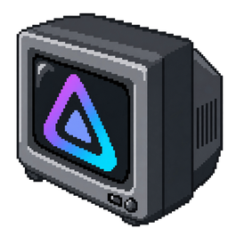

# MiSTerFin CRT

<p align="center">
  
</p>

MiSTerFin CRT is a Jellyfin client for MiSTer FPGA, designed for CRT televisions. It supports movies, TV, live TV, music, and photos.

I’m continuing MiSTerFin’s focus on a great Jellyfin experience on CRTs. I test and use it on a MiSTer connected to a consumer 4:3 CRT television, not a PVM or an HD set. I tested the client with Jellyfin 12.


## Run on MiSTer

For a new installation, download `misterfin-crt-vX.Y.Z-mister.zip` from the [latest release](https://github.com/trentnix/misterfin-crt/releases/latest). Extract the ZIP and copy these files to the SD card. Make the launcher and both binaries executable if your filesystem requires it. If upgrading an existing installation manually, exit the application first and keep your configuration and state files.

| File | Destination |
| --- | --- |
| `misterfin-crt/misterfin-crt` | `/media/fat/misterfin-crt/misterfin-crt` |
| `misterfin-crt/mplayer-arm` | `/media/fat/misterfin-crt/mplayer-arm` |
| `Scripts/MiSTerFin-CRT.sh` | `/media/fat/Scripts/MiSTerFin-CRT.sh` |

Copy the remaining files from the ZIP’s `misterfin-crt` directory into `/media/fat/misterfin-crt/`. The archive includes examples, notices, and version information but no active configuration or saved state. Its `INSTALL.txt` has detailed instructions. To build from source, follow the [build guide](docs/GO_BUILD.md).

For a new installation, create `/media/fat/misterfin-crt/jellyfin.conf` containing your server URL:

```text
http://your-jellyfin-server:8096
```

Launch **MiSTerFin-CRT** from the Scripts menu. Approve the displayed Quick Connect code in Jellyfin. The launcher filename must contain no spaces. Login, playback choices, and artwork caches persist on the SD card.

## Updates

The client checks for the latest public release at startup. An available update appears beneath the carousel title. Use **Check updates** in About to check again.

1. While browsing, press START/Menu on a controller or F1 on a keyboard to open **About**.
2. Select **View release** and review the changes.
3. Select **Install** and wait for completion. The app exits after a successful update. Reopen MiSTerFin CRT.

Updates replace the application, matching MPlayer, and standard launcher together. Your settings, sign-in, playback preferences, cached artwork, and optional interlaced core are preserved. Back cancels during download or validation. During installation, wait for completion. Failed replacements restore the previous files. Interrupted replacements recover at the next startup.

Automatic updates require the standard installation paths above. Desktop and custom installations use manual installation. See [manual installation and recovery](docs/GO_BUILD.md#application-updates) for details.

## Progressive and interlaced output

The default uses MiSTer’s current display mode, normally 240p for NTSC or 288p for PAL. Interlaced output is optional: 480i for NTSC or 576i for PAL. I have tested 240p and 480i. PAL validation remains deferred.

To enable interlaced output:

1. Exit MiSTerFin CRT. Install the matching client and MPlayer builds described above.
2. Download the supported **InterlacedMenu.rbf v0.0.1** from the [display guide](docs/GO_DISPLAY.md#enable-or-disable-interlaced-output). Place it at `/media/fat/misterfin-crt/InterlacedMenu.rbf`.
3. Set the `display` section in `/media/fat/misterfin-crt/settings.json`:

```json
{"display": {"interlaced": true}}
```

Launch **MiSTerFin-CRT** from the normal Scripts menu. The application switches to the interlaced core and restores the normal menu when you exit. Synchronization is automatic. The same launcher works for both modes.

To return to the progressive default, exit the application and set `display.interlaced` to `false`:

```json
{"display": {"interlaced": false}}
```

Omitting the `display` section also restores the default on the next launch. Preserve other sections when changing this setting. The [display guide](docs/GO_DISPLAY.md) explains core verification, the scoped `MiSTer.ini` changes and backup, and hardware requirements.

## Controls

Use the D-pad to navigate and follow the on-screen button hints to select or go back. During video or music playback, any direction shows or hides controls. Triggers seek, and shoulder buttons change music tracks.

The [playback guide](docs/GO_PLAYBACK.md#playback-controls) lists controller and keyboard controls. [About](docs/GO_BROWSING.md#about-and-updates) shows the installed version and provides [updates](#updates).

To control playback from another Jellyfin client, select **MiSTerFin CRT** as the playback device. Remote play, queues, pause/resume, seeking, shuffle, and repeat are supported. See [remote control](docs/GO_REMOTE.md).

## Screenshots

Browsing and playback captures are from MiSTer. Setup previews use the same renderer with example connection details.

| Continue Watching | Video controls |
| --- | --- |
|  |  |

| Setup help | Quick Connect |
| --- | --- |
|  |  |

Also see the [movie library](docs/images/screenshots/movies-list.png) and [movie details](docs/images/screenshots/movie-info.png).

## Configuration

To change video conversion limits, add a line such as `640x480@8000000` to `jellyfin.conf` and restart. The values are maximum width, maximum height, and bitrate in bits per second. The default is `720x576@12000000`. The profile applies to recorded video and Live TV. See [transcode configuration](docs/GO_PLAYBACK.md#transcode-configuration).

Application settings live in **`settings.json`** beside `jellyfin.conf`. On MiSTer, that is `/media/fat/misterfin-crt/settings.json`. For a new installation, copy [settings.example.json](settings.example.json) and edit the sections you need. For an existing installation, use the migration command below before creating this file. Omitted sections and fields use defaults. Restart after changing settings. Jellyfin connection details remain in `jellyfin.conf`.

```json
{
  "ui": {
    "title": "MiSTerFin CRT",
    "navigation_sounds": {
      "enabled": false
    }
  },
  "background": {
    "image": "background.png"
  },
  "display": {
    "interlaced": false
  }
}
```

| Setting | Defaults and options | Guide |
| --- | --- | --- |
| `ui.title` | Heading: `MiSTerFin CRT`. An explicit empty `title` hides it. Long titles are truncated. | [Title](docs/GO_CONFIGURATION.md#browsing-title) |
| `ui.navigation_sounds` | `enabled: true`, `volume: 10` out of 100. False or volume zero silences navigation sounds. | [Sounds](docs/GO_CONFIGURATION.md#navigation-sounds) |
| `background` | Generated carousel mosaics and item artwork on lists. `image` selects one custom background. | [Background](docs/GO_CONFIGURATION.md#browsing-background) |
| `display` | `interlaced: false`. Keep the current display, normally progressive. | [Display](docs/GO_DISPLAY.md) |
| `input` | Built-in controller mappings and button labels. Profiles override matching devices. | [Input](docs/GO_INPUT.md) |
| `music_visuals` | Music playback appearance only. `default_background: "Starfield"`, `show_audio_meters: true`. Missing optional Toasty sprites are omitted. | [Music visuals](docs/GO_MUSIC.md) |
| `diagnostics` | Off unless `DEBUGLOG` is set. Path: `debug.log`. Limit: 1 MiB per file. | [Diagnostics](docs/GO_DIAGNOSTICS.md) |

Existing installations still read the separate JSON files when `settings.json` is absent. To combine those files on MiSTer:

```bash
/media/fat/misterfin-crt/misterfin-crt -migrate-settings -config /media/fat/misterfin-crt/jellyfin.conf
```

Migration preserves the originals and refuses to overwrite `settings.json`. Once the new file exists, omitted sections use defaults instead of reading old files. See [configuration paths, migration, and recovery](docs/GO_CONFIGURATION.md).

### Browsing background

To use one custom image on the carousel and browsing lists, set `background.image` in `settings.json`:

```json
{
  "background": {
    "image": "background.png"
  }
}
```

Place the image in the same directory, or use an absolute path. PNG and JPEG are supported, up to 4 MiB and 2048 pixels in either dimension. A 4:3 image fits best. The client crops and dims it to keep the interface readable. Restart to apply changes. An omitted or empty `image` keeps the normal artwork.

The client checks the file contents, not its extension. A video, text file, unsupported image format, or corrupt image is rejected. Missing or invalid image files fall back to the normal artwork with a brief on-screen notice. With diagnostics enabled, the fallback also records a `configuration.fallback` event. Startup continues.

### Sounds and caches

To turn off navigation sounds, set `ui.navigation_sounds`:

```json
{
  "ui": {
    "navigation_sounds": {
      "enabled": false
    }
  }
}
```

Sound settings affect browsing feedback only. They do not change music or video volume.

`MISTERFIN_CACHE_ROOT` changes where artwork and carousel collages are cached. The default root is `/media/fat` on MiSTer and the user’s cache directory, usually `~/.cache`, for local testing. The client stores caches under `misterfin-crt` within that directory. See [artwork caching](docs/GO_BROWSING.md#persistent-artwork-cache) for details.

## Local development and testing

I use the Ghostty harness on Linux to develop and test the interface without MiSTer hardware. It also helps verify that the architecture supports different display pipelines while reusing the same UI and application logic. From the repository directory, run the browsing demo:

```bash
python3 tools/ghostty/ghostty_harness.py --demo --ntsc
```

The harness builds the client automatically. See the [development harness guide](tools/ghostty/README.md) for dependencies, connecting to Jellyfin, and testing playback.

## Deferred work

- **PAL/576i and direct MiSTer YPbPr validation:** I do not have suitable hardware to test these output paths. My tested setup uses MiSTer configured for RGB through its 9-pin output and a Retrovision YPbPr cable to a consumer 4:3 CRT.
- **Zaparoo DDR integration:** Deferred until I have a way to test it. Zaparoo is not required for the supported interlaced output.
- **MiSTer background-music hardware validation:** Suspension and restoration are implemented and covered by automated tests. Testing with the actual add-on is deferred because I do not use it. This is separate from Jellyfin music playback.

## More information

See the [documentation index](docs/README.md) for all guides and current limits.

- [Browsing, Continue Watching, and artwork caches](docs/GO_BROWSING.md)
- [Playback and controls](docs/GO_PLAYBACK.md)
- [Subtitles, audio tracks, and picture modes](docs/GO_PLAYBACK.md#video-options)
- [Builds and tests](docs/GO_BUILD.md)
- [Rendering architecture](docs/GO_RENDERING.md)

## Origins and license

I started MiSTerFin CRT as a Go port of [MiSTerFin](https://github.com/puddingstudio/MiSTerFin) by Pudding Studio, including my [C changes](https://github.com/trentnix/MiSTerFin). I maintain it independently. It remains heavily based on MiSTerFin, an excellent project.

Original MiSTerFin material is copyright © 2026 Pudding Studio. My additions and modifications are copyright © 2026 trentnix. I distribute the application under [CC BY-NC 4.0](LICENSE), except for components covered by [separate licenses](docs/THIRD_PARTY.md), including the GPL-licensed MPlayer.
