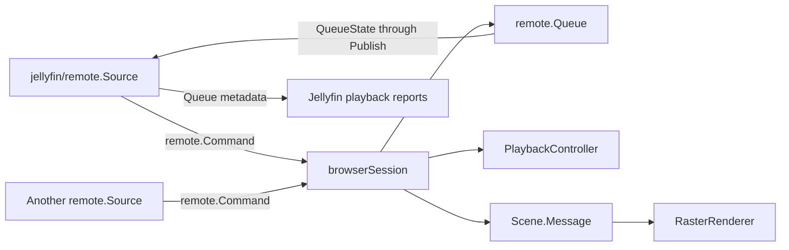

# Remote control

MiSTerFin CRT accepts Jellyfin remote commands after sign-in. In Jellyfin’s web client or app, select MiSTerFin CRT as the playback device. The same implementation runs on MiSTer and in the development harness. No extra configuration or listening port is required.

## Supported commands

| Action | Behavior |
| --- | --- |
| Play | Start audio or video from another Jellyfin client. Ordered item lists and a selected starting index form a queue. An explicit start position is honored. |
| Play next / Play last | Insert items after the current entry or append them. Duplicate items have separate queue identifiers. |
| Previous / Next | Move one queue entry per command. Previous selects the previous item directly. It does not first restart the current track or require an overlay. |
| Pause / Resume / Toggle | Control playback independently of About, View, and control-menu visibility. Repeated Pause or Resume commands are idempotent. |
| Stop | Stop media and return to browsing without exiting the application. Cancel pending remote playback requests. |
| Seek | Seek to a destination in recorded video or music. Video uses the existing stream handoff. Music uses the decoder’s seek support. Live TV does not seek. |
| Shuffle | Shuffle upcoming entries without restarting the current item. Turning shuffle off restores the original order. Jellyfin’s random-play requests also work. |
| Repeat | Support RepeatNone, RepeatAll, and RepeatOne. Explicit Previous/Next still change entries with RepeatOne selected. |
| Message | Show an administrator message for eight seconds through the shared renderer, including over native or inline video. |

The existing playback reports include the queue, current occurrence, repeat mode, playback order, and seek capability. Jellyfin can display the queue and select an entry. Reordering a queue while retaining the current item preserves the running decoder when the command has no explicit start position. The reviewed Jellyfin web remote player does not send a removal command from its remove-from-queue method. That web-client limitation is separate from queue reporting and playback.

Locally started music also exposes its queue. Complete album pages are reused. Longer music lists resolve in the background while playback continues. Existing whole-library shuffle reports its retained batch and keeps loading rolling batches. An explicit remote queue operation takes over that retained batch. Queues are limited to 10,000 entries. Queue lookup has a 30-second limit. Queue order and repeat state last for the application session and are not saved to disk.

Only Audio and Video are advertised as remotely playable. Volume, mute, screenshots, remote photo playback, remote subtitle selection, and remote audio-track selection are not advertised. The existing on-screen track and caption controls remain available. The alternate FFplay harness path cannot show shared video-message overlays and does not support music seeking. MiSTer and inline Ghostty support both.

## Connection and lifecycle

The Jellyfin adapter opens the authenticated session WebSocket using the configured server URL, including any reverse-proxy base path. HTTP and HTTPS are supported. HTTPS uses the same certificate policy as metadata and media requests. Certificates are verified unless `INSECURE_TLS` is explicitly configured. Socket redirects are refused so credentials cannot move to another origin.

The socket upgrade sends the same authorization header and client identity as normal API requests. Servers can reject credentials supplied only in the socket URL. Optional diagnostics records `remote.socket` with the HTTP status and failure flag, without logging credentials or socket URLs.

The adapter registers supported capabilities on each connection, sends keep-alive messages, responds to the server’s requested heartbeat interval, and checks socket liveness. A disconnected socket retries after five seconds. The browser remains usable during reconnection. Signing in again cancels the old source and rejects commands from the old account generation. Exiting cancels and joins the source. Incoming frames, queued commands, and on-screen message lengths are bounded. Raw messages and authenticated socket URLs are not logged.

## Interfaces and ownership

`internal/remote.Source` is the control boundary. `remote.PlayMode` gives play commands explicit replacement, insertion, shuffle, and mix modes. `Run` emits owned `remote.Command` values until cancellation. `Publish` accepts an owned queue snapshot without network I/O on the browser loop. A different control mechanism can implement the same interface. `browser.Config.Remote` supplies the source factory after authentication. A nil factory disables remote control for an embedding application or test.

`internal/jellyfin/remote.Source` owns capability registration, WebSocket connections, protocol translation, and queue-report conversion. `internal/remote.Queue` owns ordering, occurrence identifiers, shuffle, and repeat rules without importing Jellyfin or playback code. `remoteRequests` owns catalog cancellation and pending requests. `remotePlayback` owns queue metadata and decoder handoffs. Both are owned by the browser event loop. `jellyfin.Client.AudioQueue` and remote container expansion share bounded pagination in the catalog client. The browser schedules that work asynchronously and applies only current results. `PlaybackController` owns the current decoder and seek transitions. The source never draws or calls a player directly.

## Validation

Tests cover HTTP and HTTPS with a trusted certificate, rejection of untrusted certificates and socket redirects, reconnect registration, cancellation, command validation, duplicate queue entries, repeat/shuffle behavior, start index, queue reordering, one-command previous navigation, rapid skips, stopped replacements, stale account results, menu-independent controls, and message expiry. The built-client test sends WebSocket commands through an isolated Jellyfin fixture and verifies decoder changes and outgoing queue/progress reports. The libmpv test verifies forward and backward music seeks while paused.

The implementation addresses [MiSTerFin issue #39](https://github.com/puddingstudio/MiSTerFin/issues/39). Protocol behavior was checked against Jellyfin’s [session manager](https://github.com/jellyfin/jellyfin/blob/master/Emby.Server.Implementations/Session/SessionManager.cs), [capabilities model](https://github.com/jellyfin/jellyfin/blob/master/MediaBrowser.Model/Session/ClientCapabilities.cs), and [web remote player](https://github.com/jellyfin/jellyfin-web/blob/master/src/plugins/sessionPlayer/plugin.js). The maintainer tested remote control on the physical CRT, including movie and episode playback, and reported that the tested controls worked. The later architectural cleanup has automated coverage and has not yet been deployed.
