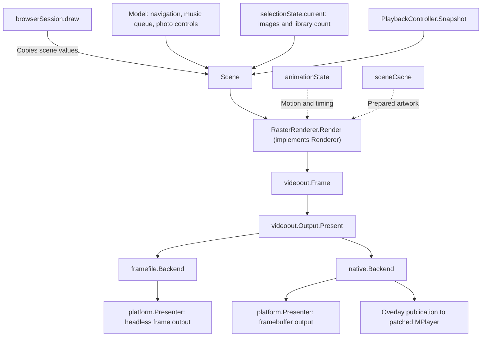

# Playback controller and rendering

`PlaybackController` is a concrete Go struct in `internal/browser/playback_controller.go`. It owns the current item, active and pending decoder resources, seek debounce, cancellation, pause restoration, and playback notices. `browser.Run` owns input and session lifetime and dispatches actions, timer ticks, worker results, and typed decoder events. `browserSession` owns navigation, request cancellation, selection loading, media navigation, and presentation. Its handlers coordinate those responsibilities with the controller.

`Model` owns the navigation stack, music queue presentation, and photo menu timer. `PlaybackController` exclusively owns its private `playbackState`. The model and controller share no mutable playback state.

The browser submits every screen through `videoout.Output.Present(Frame)`. It has no direct `platform.Display` dependency. The selected backend handles browsing, video composition, and loading fallback.

`cmd/misterfin-go/main.go` selects both the renderer and output backend. `browserSession` depends on `Renderer` and `videoout.Output`. Its `draw` method constructs a `Scene`, asks the renderer for pixels, and presents them. It owns frame pacing and the request to refresh paused video when an overlay changes. It does not implement animation or call concrete drawing functions.

## Event loop ownership

Only the event loop mutates `browserSession`. Workers capture their request inputs and send results through channels. Authentication and page loading share one cancellation scope. Selection loading and media navigation each have their own cancellation scope and generation counter. Their handlers reject obsolete results before changing the model.

Handlers return whether an event requires an immediate redraw. `Run` performs that redraw in one place. Timer ticks update playback and render at the interval supplied by `Output.FrameInterval(scene.Video)`. Outputs can implement `FrameNotifier` to request an immediate redraw when a video frame arrives. Shutdown cancels the session context before waiting for decoder completion, so callbacks cannot block after event dispatch stops.

## Renderer contract

`Renderer.Render(width, height, Scene)` accepts positive logical dimensions and returns `videoout.Frame`. A renderer owns its animation, caches, and frame storage. It must not perform network/device I/O or change navigation. Calls are serial. Returned pixels are borrowed until the next render call, so the caller must present or copy them first.

`Scene` copies the current view and scalar UI values without exposing `Model` or `playbackState`. It carries artwork, a separate library count, status text, time, a `PlaybackPresentation` for music and video, and photo menu visibility. Position, pause state, and playback control visibility remain in the playback snapshot. The current view borrows Jellyfin item slices and detail pointers for the synchronous render call. Renderers must not mutate or retain those navigation references. Artwork is immutable after publication and may be retained for caching.

`RasterRenderer` implements the shared pixel renderer. For each frame, `renderScene` creates a temporary `screenPainter` that borrows the canvas, scene, animation values, and cache. It selects one screen method. Browsing screens then share footer and notice drawing. The painter owns no persistent state or resources. `animationState` owns selection easing and marquee timing. `sceneCache` owns prepared artwork. Reusable UI and overlay canvases are invalidated together when geometry changes. A replacement raster renderer can implement `Renderer` and be injected at application assembly without changing browser navigation or output backends.

The output split remains downstream of shared UI drawing. Ghostty composites clean decoder frames and UI in its backend. MiSTer publishes UI overlays while MPlayer owns the display and presents browser/loading frames itself otherwise. The optional companion backend supports a separate player window.

## Presentation contract

`videoout.Frame` contains a full BGRX `UI` frame, a straight-alpha BGRA `Overlay`, and a `Video` flag. `Video` expresses UX intent and stays true while loading or seeking, even when no decoder owns the display. The backend borrows pixel slices for the duration of `Present`. `Output.Geometry()` supplies the layout dimensions.

`Output.FrameInterval(video)` supplies the presentation cadence. Browser screens use 60 Hz. The frame-file backend also keeps a 60 Hz animation timer, while native and companion backends retain 30 Hz overlay updates because their players present video independently.

The frame-file backend implements `FrameNotifier` and watches atomic decoder publications with inotify. A new frame wakes the shared event loop immediately instead of waiting for the animation timer. Notifications coalesce when rendering falls behind. The watcher closes with the output backend, and the timer remains available for loading and paused overlays.

For browsing, photos, and music, each backend presents `UI` through its internal `platform.Presenter`. During video playback, the Ghostty `framefile` backend reads clean frames from its decoder file and composites `Overlay`. If no valid frame exists, it uses black. The native backend publishes the overlay for patched MPlayer and continues presenting the overlay over black until MPlayer has its first video frame. The companion backend composites the overlay over `UI` while a separate player window displays video.

`Acquire` and `Release` bracket the external decoder's lifetime. Each backend coordinates the actual display handoff. On MiSTer, Go takes an advisory lock while presenting each loading frame. MPlayer takes the same lock just before presenting its first frame and retains it until output teardown or process exit. Go then only publishes overlays until `Release`. The lock prevents simultaneous framebuffer writes without adding waits to subsequent video frames.

The lock file remains in place across decoder lifetimes so both processes always use the same inode. The Go client and its patched MPlayer must both implement this handoff.

The native driver emits `ANS_VIDEO_STARTED=true` once after writing its first frame. `positionWriter` passes that signal through `Options.VideoStarted` to the browser's `PlaybackVideoStarted` event. The controller clears loading immediately without waiting for MPlayer's one-second position poll or inventing a position. Decoders without this signal retain the existing position-based fallback. First-frame state resets for every replacement decoder, and stale decoder events cannot clear loading for its replacement.

`Clear` discards stale playback output before a new item and after playback ends. The application creates the backend once and closes it before closing the underlying display. Backends accept `platform.Presenter`, which exposes only geometry and presentation. `platform.Display` adds `Close` for the application that owns the device. A new presenter can therefore implement pixel delivery without pretending to own display resources. The browser does not select a display path per frame.

The Ghostty harness watches completed Go frame writes. It uploads changed frames on arrival, subject to the configured presentation cap. Upload time counts toward that cap, and expired slots are skipped after stalls. Decoder frames, Go composition, and terminal uploads no longer wait for independent polling ticks.

The terminal presenter uploads the next image before changing any visible placement. It then places the new image and removes the old one inside a single [synchronized-output update](https://ghostty.org/docs/help/synchronized-output), preventing intermediate screen states during the swap. The pixel payload remains opaque RGB and does not blend consecutive video frames.

## Source map

Each backend lives in its own subpackage and exports `New` and a concrete `Backend` type implementing `videoout.Output`. The shared `videoout` package has no dependency on its implementations. Application wiring selects the implementation.

- [`main.go`](../cmd/misterfin-go/main.go): signal handling, display lifetime, output selection, and application wiring.
- [`options.go`](../cmd/misterfin-go/options.go): command-line parsing and mode validation before resources open.
- [`preview.go`](../cmd/misterfin-go/preview.go): test-frame display and its optional wait.
- [`run.go`](../internal/browser/run.go): input lifetime, event dispatch, and the single redraw decision.
- [`session.go`](../internal/browser/session.go): session state, construction, and cleanup.
- [`session_requests.go`](../internal/browser/session_requests.go): authentication and listing requests, cancellation, and generation checks.
- [`session_selection.go`](../internal/browser/session_selection.go): selected metadata and images, loading, error handling, and stale-result rejection.
- [`session_media.go`](../internal/browser/session_media.go): playback completion and asynchronous neighbor requests for photos and music.
- [`model_media.go`](../internal/browser/model_media.go): parent snapshots, adjacent selection, return navigation, music queue presentation, and the independent photo menu timer.
- [`session_input.go`](../internal/browser/session_input.go): action routing and screen-specific controls.
- [`session_result.go`](../internal/browser/session_result.go): worker result kinds and dispatch.
- [`session_render.go`](../internal/browser/session_render.go): scene assembly, frame pacing, and presentation.
- [`scene.go`](../internal/browser/scene.go): read-only rendering input assembled from navigation, artwork, and one playback snapshot.
- [`renderer.go`](../internal/browser/renderer.go): replaceable renderer interface.
- [`raster_renderer.go`](../internal/browser/raster_renderer.go): concrete renderer and frame-buffer ownership.
- [`animation.go`](../internal/browser/animation.go): per-renderer motion and title timing.
- [`render.go`](../internal/browser/render.go): screen dispatch and uncached rendering entry points.
- [`render_layout.go`](../internal/browser/render_layout.go): frame-local `screenPainter`, CRT safe areas, title marquee, clock, and browsing footer.
- [`render_status.go`](../internal/browser/render_status.go): connection and Quick Connect screens.
- [`render_photo.go`](../internal/browser/render_photo.go) and [`render_music.go`](../internal/browser/render_music.go): photo viewing and music playback screens.
- [`render_details.go`](../internal/browser/render_details.go): artwork and metadata on item details.
- [`render_carousel.go`](../internal/browser/render_carousel.go) and [`render_list.go`](../internal/browser/render_list.go): library carousel and paginated lists.
- [`render_video.go`](../internal/browser/render_video.go): video companion backdrop and playback overlays.
- [`render_metadata.go`](../internal/browser/render_metadata.go): item titles, subtitles, and count labels.
- [`scene_cache.go`](../internal/browser/scene_cache.go): prepared artwork cache.
- [`output.go`](../internal/videoout/output.go): `Frame` and the shared `Output` interface.
- [`frame_file.go`](../internal/videoout/framefile/frame_file.go): Ghostty frame-file backend and video composition.
- [`native.go`](../internal/videoout/native/native.go): MiSTer backend, framebuffer ownership, and overlay publication.
- [`handoff.go`](../internal/videoout/native/handoff.go): MiSTer first-frame handoff shared with the patched MPlayer output driver.
- [`companion.go`](../internal/videoout/companion/companion.go): companion UI backend for a separate player window.
- [`display_linux.go`](../internal/platform/display_linux.go): framebuffer and headless presentation through the C adapter.
- [`ghostty_harness.py`](../tools/ghostty/ghostty_harness.py): terminal presentation of headless frames.
- [`video_player.py`](../tools/ghostty/video_player.py): libmpv decoding and publication of clean video frames.
- [`playback_controller.go`](../internal/browser/playback_controller.go): controller ownership, item lifecycle, input actions, and player commands.
- [`playback_seek.go`](../internal/browser/playback_seek.go): seek phases, debounce, retargeting, replacement launch, handoff, and failure recovery.
- [`playback_event.go`](../internal/browser/playback_event.go): decoder event types and dispatch, position updates, and completion handling.
- [`playback_driver.go`](../internal/browser/playback_driver.go): external-player launch, callbacks, and the dedicated decoder event channel.
- [`playback_process.go`](../internal/browser/playback_process.go): decoder resources, cancellation, start gate, and completion wait.
- [`playback_state.go`](../internal/browser/playback_state.go): controller-owned UI state, menu visibility, destination accumulation, and loading or buffering labels.
- [`playback_presentation.go`](../internal/browser/playback_presentation.go): pointer-free rendering snapshot and its construction.

The controller methods span lifecycle, seeking, and event files because those responsibilities have distinct transitions. The smaller state, process, and presentation types each live with their methods.

A seek starts with a destination preview and a 0.5-second deadline. When the deadline expires, `seekPreparing` captures the user's pause preference, pauses the original decoder if needed, and prepares a replacement. A ready replacement waits behind a start gate until the original decoder ends. Further arrow presses cancel the replacement and enter `seekRetargeting`, which shows the destination again and renews the deadline without overwriting the original pause preference. The controller opens the gate only after preparation succeeds and the original decoder has released its output. Position feedback then restores the user's pause preference.

## Controller contract

- `Start(item, offset, paused, now)` starts an item and resets its playback UI state. An explicit zero offset implements SELECT restart.
- `Key(action, now)` handles pause, control toggling, video seek, and stop. The browser handles music track selection separately.
- `Tick(now)` starts a pending seek after the half-second deadline. Retargeting cancels the obsolete replacement and restarts that deadline.
- `Handle(event, now)` applies decoder feedback. It returns true when the active item ends and the browser must handle navigation or track advancement. Seek handoffs and stale decoder events do not end the item.
- `Snapshot(now)` returns display information without mutable pointers, decoder handles, navigation state, or output-specific flags.
- `Refresh()` asks the active player to refresh its paused output. The output adapters remain responsible for pixel presentation.
- `StopForTrackChange()` stops the current decoder without treating the stop as a user exit from playback.
- `Close()` cancels and waits for the tracked active and pending decoders.

`PlaybackEvent` identifies the decoder and one event kind: prepared, position, paused, buffering, or ended. Each `playbackProcess` groups its identifier, cancellation function, completion channel, asynchronous cleanup signal, preparation gate, and readiness flag. A `playbackLaunch` function connects the controller to real decoding. Tests supply a deterministic function that records launch requests and cancellation.

The controller has no dependency on `platform`, `videoout`, terminal input, fonts, or canvas drawing. `playbackDriver` wires `AcquireVideo` and `ReleaseVideo` callbacks to the selected output adapter. It sends `PlaybackEvent` values through a dedicated channel directly to the browser loop. Decoder feedback no longer shares the browsing and artwork result queue or allocates an event pointer per update. Progress can be dropped when the decoder event queue is full. Lifecycle events wait for delivery unless the application is shutting down.

## Selection loading and artwork ownership

`selectionLoader` coordinates metadata and images for the selected item. It refreshes non-photo detail metadata on every visit, including watched state after playback. Detail images use the refreshed metadata. If metadata fails, images can still load from the existing item. Photos start immediately without a detail request. List images and carousel cover samples wait for the existing 120-millisecond selection debounce.

Library counts start independently of carousel samples and images. A slow count does not delay covers, and slow images do not delay counts. `libraryCache` retains at most 32 libraries, with separate one-minute deadlines for counts and sample metadata. Metadata expiry does not evict decoded images.

`mosaicDiskCache` persists each library's decoded collage separately from the C cache. Selection workers restore saved images before querying current sample IDs and tags, then delegate missing images to `artworkLoader`. Cached pixels populate the existing image cache, so unchanged tags avoid both downloads and decoding after restart. The browser loop performs no cache file I/O. Counts remain independent of collage persistence.

A complete `covers` artwork update replaces the sample as a unit before individual cover updates arrive. This also clears an obsolete collage when a refreshed library is empty. Only complete, uncanceled samples replace the disk file, and identical contents do not rewrite it. Retry defers disk invalidation to the selection worker. See [cache locations and limits](GO_BROWSING.md#persistent-collage-cache).

`artworkLoader` handles only image requests, normalization, and retention. Its three-request limit is shared across selections. `artworkCache` retains at most 16 MiB and 128 decoded images. The cache performs no network requests. Cached images remain immutable after publication, and completed images survive selection cancellation. Carousel image workers retain the sample order when publishing completed covers.

`selectionState` belongs to the browser loop. It tracks the current selection, cancellation, generation, presentation data, and error. `selectionUpdate` distinguishes detail metadata, library counts, and artwork. Its generation is checked before any result changes the model or screen. `Artwork` contains only images. `Scene.LibraryCount` carries the count separately. Retry invalidates the selected item's metadata and images through `selectionLoader.forget`.

- [`selection_loader.go`](../internal/browser/selection_loader.go): detail loading, image coordination, debounce, cached snapshots, and retry invalidation.
- [`selection_library.go`](../internal/browser/selection_library.go): independent library counts and carousel sample queries.
- [`selection_update.go`](../internal/browser/selection_update.go): selection presentation data and typed progressive results.
- [`mosaic_disk_cache.go`](../internal/browser/mosaic_disk_cache.go): cache locations, server/user isolation, atomic file replacement, and disk limits.
- [`mosaic_cache_format.go`](../internal/browser/mosaic_cache_format.go): versioned manifests, bounded RGBA records, and checksum validation.
- [`library_cache.go`](../internal/browser/library_cache.go): bounded library metadata retention and separate expiry deadlines.
- [`artwork.go`](../internal/browser/artwork.go): immutable image inputs for rendering.
- [`artwork_loader.go`](../internal/browser/artwork_loader.go): image loader resources, dimensions, and request limit.
- [`artwork_cache.go`](../internal/browser/artwork_cache.go): tagged image retention, eviction, snapshots, and invalidation.
- [`artwork_fetch.go`](../internal/browser/artwork_fetch.go): cache lookup, request slots, RGBA normalization, and independent item images.
- [`artwork_covers.go`](../internal/browser/artwork_covers.go): bounded image workers for a resolved carousel sample.
- [`artwork_update.go`](../internal/browser/artwork_update.go): image results and their application to displayed artwork.

## Jellyfin client ownership

The application shares one `jellyfin.Client`. Endpoint methods use the same HTTP transport, configuration, and authenticated session. Authentication mutates the session and must finish before concurrent browsing, artwork, or playback requests begin.

- [`client.go`](../internal/jellyfin/client.go): client construction, authenticated requests, response limits, and status errors.
- [`authenticate.go`](../internal/jellyfin/authenticate.go): saved-session validation, API-key sign-in, and Quick Connect.
- [`library.go`](../internal/jellyfin/library.go): library lists, details, counts, and carousel cover queries.
- [`images.go`](../internal/jellyfin/images.go): tagged image requests, bounded decoding, and resizing.
- [`item.go`](../internal/jellyfin/item.go): item metadata, pages, stream geometry, and browsing locations.

The query fields, endpoints, redirect policy, and authentication fallback order remain the same. Image decoding is separate from request construction so pixel bounds do not depend on HTTP behavior.

## External player ownership

[`playback.Run`](../internal/playback/player.go) shows the complete decoder lifecycle. It selects a decoder from [player options](../internal/playback/options.go), locates the executable, [prepares playback](../internal/playback/prepare.go), opens the source, waits for the controller’s start gate, and starts monitoring the process.

- [`mediaSource`](../internal/playback/media_source.go) owns the authenticated stream or local audio proxy.
- [`playerProcess`](../internal/playback/process.go) owns process lifetime, pipes, stream copying, and decoder feedback channels. It delegates pause, polling, and refresh to the selected decoder.
- [`playbackSession`](../internal/playback/session.go) owns decoder monitoring, startup timeout, pause state, and the latest playback position.
- [`progressReporter`](../internal/playback/progress_reporter.go) owns ordered Jellyfin reporting on a separate worker.
- [`positionWriter`](../internal/playback/position_writer.go) parses numeric progress, first-frame feedback, and buffering feedback without forwarding decoder diagnostics.

The private `decoder` interface separates executable protocols from process and session ownership. Each implementation supplies its executable, arguments, input transport, and pause, poll, and refresh behavior. Implementations hold immutable launch configuration. `decoderControl` lends them stdin and process-group signaling without transferring ownership of the child process.

- [`decoder.go`](../internal/playback/decoder.go): the interface, source transport choices, option validation, helper precedence, and executable lookup.
- [`decoder_mplayer.go`](../internal/playback/decoder_mplayer.go): MPlayer slave commands, CRT aspect correction, audio filters, and synchronization arguments.
- [`decoder_ffplay.go`](../internal/playback/decoder_ffplay.go): FFplay arguments and process-group pause/resume signals.
- [`decoder_python.go`](../internal/playback/decoder_python.go): Python helper arguments, explicit pause/resume commands, and the clean video frame destination.

`Options` remains the application-facing configuration. Selection converts its decoder fields into one implementation before session preparation. The shared lifecycle, source loader, and monitoring loop do not branch on `Headless` or `TerminalPlayer`. They retain source authentication, startup gating, cancellation, feedback, and Jellyfin reporting. MPlayer and the Python helper use a local range-capable proxy for audio. Other streams use file descriptor 3.

Polling remains once per second. MPlayer sends a position query. FFplay and the Python helper already publish progress, so their poll methods do nothing. Paused-frame refresh sends a command only through MPlayer. The decoder interface introduces no frame copying or rendering work. UX construction and the downstream `videoout.Output` boundary remain separate from decoding.

The playback loop reaps the decoder before returning. Cleanup then cancels media work, stops stream copying, releases video output, closes the source, and finalizes reporting. Live TV closes its negotiated stream afterward. During seek handoffs, the controller can allow final reporting to continue asynchronously. That reporting uses a copy of the completed session state.

## Progress reporting ownership

`progressReporter` performs Jellyfin reporting outside the decoder monitoring loop. The loop queues copied state after the first position, every ten seconds, and after a successful pause/resume command. Controls, position feedback, buffering feedback, and decoder completion do not wait for those HTTP requests. Callbacks still run on the playback loop.

The worker retains an initial start/progress job and at most one pending progress job. New progress replaces stale pending progress, including superseded pause state. Coalescing preserves a pending request to save resume data and uses the newest position and watched state. Start and stop are not coalesced. A short mutex protects the mailbox, and a buffered notification wakes the single worker. Network requests never hold the mailbox lock.

Finalization replaces pending progress with the final state. Normal completion finishes the initial or in-flight report before stop/save. Stop, decoder failure, and asynchronous seek handoffs cancel routine reporting. The final stop/save job has a fresh five-second context, so canceled reporting cannot consume its deadline. Routine reporting retains the shared Jellyfin client's request timeout. The single worker sends requests in order and exits after final cleanup.

Routine reporting failures remain visible when decoding completes successfully. Intentional cancellation does not become a reporting error. Final stop/save failures remain best effort, preserving the existing error policy. State snapshots also copy optional boolean fields so asynchronous cleanup cannot observe later caller mutations. The reporting worker adds no work to frame rendering or stream copying.

## Navigation and playback ownership

`PlaybackPresentation` carries decoder activity, media type, title, position, duration, seek destination, pause state, control visibility, wait label, and notice. `renderVideoOverlay` accepts the snapshot and time for animation. It no longer inspects the browser view stack or Jellyfin item.

`PlaybackController` owns `playbackState` as a private value. Browser handlers send actions and decoder events to the controller. Rendering receives only its value snapshot. `sceneFromModel` combines that snapshot with navigation and artwork once per frame. `draw` uses the completed scene for frame pacing, rendering, and paused-overlay refresh.

`Model` keeps the music queue screen active while the decoder stops and the next track is found. Decoder completion alone does not return to the list. `SelectAdjacent` commits the parent page, selection, detail item, and title together after a matching result arrives and the old decoder stops. `ReturnToParent` restores the saved list position, invalidates listing results, and clears queue and photo menu state. Worker cancellation and generation checks remain in the session handlers.

Photo navigation uses its own three-second menu timer in `Model`. `Scene.PhotoControlsVisible` carries that visibility to the photo renderer. Playback menus and seek pins cannot change photo menu visibility. Adjacent photos retain an open menu until its deadline. Leaving and reopening a photo clears the menu.

Playback notices retain their existing behavior. Notices are available in the snapshot, but the video overlay does not yet draw them. Shared layout geometry, pixel formats, headless cgo usage, and frame transport are unchanged. The output interface now carries both browser and playback frames.

## Validation

`TestRenderScreenPixels` compares 40 PAL/NTSC screen cases against hashes captured before extracting the screen drawing methods. The cases cover connection screens, browsing modes, details, photos, music, and video overlays. Existing tests also compare cached and uncached output and verify overlay clearing. The 40 pixel baselines, overlay-clearing test, and video-backdrop cache test passed on both the host and MiSTer’s ARM CPU after the extraction.

Navigation tests cover adjacent selection, restoring the parent page and scroll position, stale listing rejection, and independent photo menu timers. Session tests cover the music screen between decoder runs, committing a queued track only after decoder exit, queue completion, stop, and canceled neighbor results.

Controller tests use explicit times and simulated decoder events. They cover the half-second debounce, destination-to-seeking transitions, retargeting during old-decoder shutdown, immutable request offsets and snapshots, stale feedback, pause restoration, seek failure, Back cancellation, control expiry, and Live TV seek exclusion. Ghostty integration tests continue to exercise the real event loop and player bridge, including restart followed by a slow seek, music track changes, photos, and returning to the channel list.

Reporting tests hold a server request open while exercising pause, resume, buffering feedback, position updates, and cancellation. They also cover bounded progress coalescing, save intent, request ordering, snapshot ownership, asynchronous cleanup, reporting errors, and immediate decoder completion.

Decoder tests cover implementation selection, executable overrides, audio-helper precedence, invalid modes, source transport, exact control commands, process signals, and control transport errors. A comparison against the pre-refactor command builders matched 1,440 argument variants across media types, output sizes, aspect ratios, source forms, and player choices. Existing lifecycle tests cover real decoding, pause/resume, startup gates, cancellation, seek cleanup, live-stream release, and native synchronization arguments.

Output tests cover normal browser frames, loading before and after decoder launch, the first-frame handoff, loading after release, return to browsing, stale video files, composition, and native overlay publication. The C adapter tests verify that decoding into RAM leaves the loading lock available and that presenting the first frame claims it until output teardown.

## MiSTer drawing performance

On September 12, 2026, `BenchmarkBackdrop` measured scaling a 1280×720 RGBA backdrop to 640×240 and shading it on the MiSTer ARM CPU. The original path took approximately 141 ms per operation and allocated 614403 bytes across 153600 allocations. Direct RGBA pixel access plus a shading lookup table reduced that to approximately 19 ms and 2688 bytes in one allocation. This benchmark measures drawing work, not complete menu latency or framebuffer presentation. Pixel comparisons cover transparency, clipping, subimages, and shading.

Run the benchmark with `go test ./internal/ui -run '^$' -bench BenchmarkBackdrop -benchmem`. For hardware measurement, cross-compile that package with `go test -c` and run the test binary on MiSTer.

## Visual parity review

The September 12 comparison used `src/main.c` and `src/draw.c` from the preserved merged C baseline. List backdrops now occupy the top three quarters of the logical screen, preserving their physical 16:9 shape, with the baseline's 110/255 brightness fading to black. Header marquees run at 15 pixels per second and restart when the screen title changes. The header uses a 16-row scratch canvas instead of allocating another full frame.

Runtime labels use hours once duration reaches one hour. Artist, album, and series rows omit missing counts and use singular labels for one item. Album rows omit missing years. Detail ratings follow the year when present and start at the left margin otherwise. Both channel type names use the same channel-number formatting. Regression tests cover PAL/NTSC backdrop bounds, metadata, duration formatting, and marquee clipping.

Remaining visual gaps include music visualizers and VU meters, animated setup screens, Continue Watching and Next Up cards, About/update screens, and advanced playback menus. Some require data or playback features as well as drawing. The maintainer's requested photo/music navigation, clean pause behavior, and shared loading/seeking overlay remain intentional Go UX requirements.

## Prepared artwork and frame pacing

`RasterRenderer` owns reusable browser and overlay frames, animation state, and `sceneCache` on the event loop. List backdrops and cover panels are composed once per image/geometry change. Detail backdrops and gradients are also cached. Carousel artwork is resized and shaded into row strips once, then scrolling copies a different window from each strip. Text, selection, clocks, and controls remain dynamic.

The cache retains one prepared background and one carousel set. It compares immutable RGBA image identities, screen geometry, and tile aspect. It rebuilds when those inputs change. Unknown image implementations bypass reuse. Returned frame pixels are borrowed until the next draw, matching the synchronous output contract. Standalone `render` calls keep the uncached path for independent captures and pixel comparisons.

Complete-frame `BenchmarkBrowserFrame` measurements on the MiSTer ARM CPU were approximately 19.2 ms for a list and 36.9 ms for a carousel before caching. After caching, both measured approximately 3.0 ms. Per-frame allocations dropped from approximately 659–666 KB to 43 KB. These benchmarks exercise drawing with prepared local artwork, including animated positions. They exclude network loading, framebuffer vsync/copy, and physical input latency. First draws after cache invalidation still prepare artwork.

Browser animations now request updates at 60 Hz, matching the C carousel timeline. Native video overlays retain 30 Hz polling. The native MPlayer adapter retains clean decoded pixels in RAM and blends the latest overlay before writing each framebuffer row. The overlay remains present on every video frame, even when the UI has not changed. The native player retains the C adapter’s vsync wait in the decode path, before MPlayer schedules presentation. Video backdrops are cached instead of rescaled at the overlay update rate.

Hardware framebuffer presentation still waits for vsync, so the physical display determines the achieved cadence. Pixel comparisons pass on MiSTer for cached versus fresh frames across animation, image replacement, transparency, subimages, and PAL/NTSC geometry changes.

Selection tests cover progressive details and covers, slow counts, independent metadata expiry, warm-cache reuse, bounded metadata retention, retry invalidation, canceled debounce, and stale results. Image tests cover the shared request limit across concurrent loads, image-only requests, RGBA normalization, and retained images after cancellation.

Renderer contract tests cover copied scalar state, complete browser/video frames, overlay clearing, geometry changes, and animation timing. Output tests use a presenter with no `Close` method to verify the narrower backend dependency.

After renderer injection, the benchmark calls `Renderer.Render`, including scene-driven animation and frame assembly. MiSTer measured approximately 3.2 ms per list/carousel frame, with two allocations per frame. Hardware renderer contract tests passed. The small difference from the earlier 3.0 ms draw-only measurement does not establish a change in input-to-display latency.

Video playback must have access to both MiSTer CPU cores. Main_MiSTer pins Scripts to CPU 1, so the Go launcher widens affinity before starting the application and its decoder. A captured 29.97 fps episode sample reproduced about 2.3 seconds of A/V drift under competing work on CPU 1. The same test with both cores available stayed synchronized with no dropped frames. Decoder startup must inherit the wider mask. Changing affinity after drift accumulated did not recover the failing session. Backdrop identity checks include JPEG `*image.YCbCr` and PNG `*image.NRGBA` images as well as `*image.RGBA`, so playback does not repeat image scaling at every UI tick.
