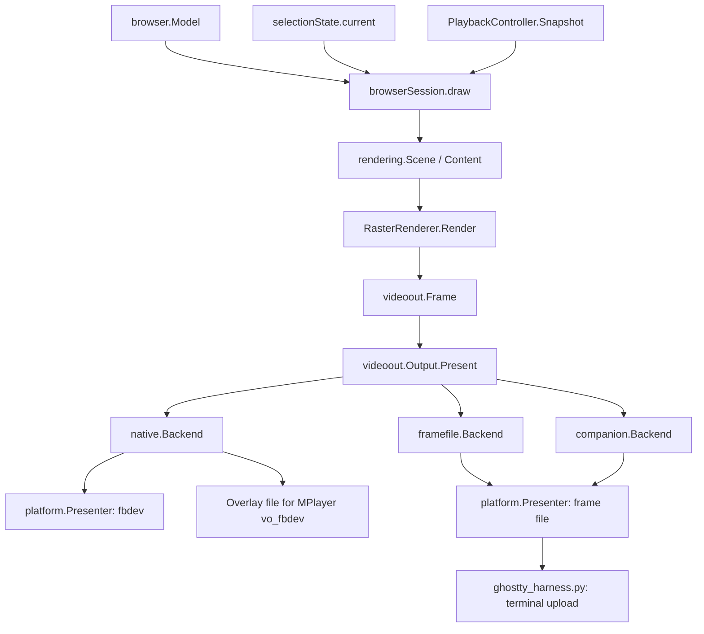
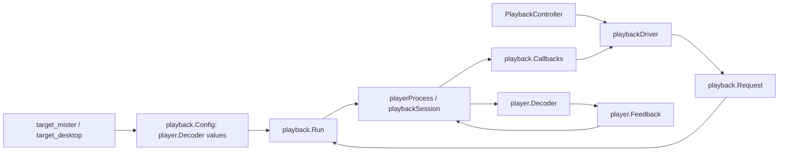

# Architecture

The browser owns navigation and playback UX. The renderer turns a read-only scene into shared pixels. Output backends handle presentation. Decoder implementations handle player protocols. Target assembly connects those parts without selecting output behavior inside the renderer.

## Shared UX and output



`RasterRenderer` owns `animationState`, `sceneCache`, and reusable frame buffers. Those are supporting state inside the shared renderer. The output split occurs after drawing. During video, each output combines the shared overlay with its decoder's picture as described below.

| Boundary | Contract |
| --- | --- |
| [`rendering.Renderer`](../internal/rendering/renderer.go) | `Render(width, height, Scene)` returns borrowed pixels. Serial calls, no I/O or navigation. |
| [`rendering.Scene`](../internal/rendering/scene.go) / [`Content`](../internal/rendering/content.go) | Copied presentation state and borrowed immutable content. No navigation history or request policy. |
| [`videoout.Output`](../internal/videoout/output.go) | Geometry, cadence, presentation, decoder acquisition/release, clearing, and backend cleanup. |
| [`platform.Presenter`](../internal/platform/display.go) | Synchronous presentation of exactly one logical BGRX frame. |
| `platform.Display` | Presenter plus resource ownership through idempotent `Close`. |

The browser must present or copy a renderer's frame before its next render call. Renderers must not mutate or retain borrowed content slices or detail pointers. Immutable artwork can be retained for caching. Outputs must consume pixels before `Present` returns or copy them. The application closes outputs before closing their underlying display.

`videoout.Frame.UI` is a full BGRX frame. `Overlay` is straight-alpha BGRA. `Video` remains true during loading and seeking, even before a decoder owns the display. For browsing, photos, and music, outputs present UI directly. For video, they apply the overlay through their own composition path.

## Output implementations

| Implementation | Browsing and video behavior |
| --- | --- |
| [`native.Backend`](../internal/videoout/native/native.go) | Presents UI/loading through fbdev. Publishes overlays while patched MPlayer owns video output. |
| [`framefile.Backend`](../internal/videoout/framefile/frame_file.go) | Reads clean decoder frames, composites the overlay, and presents a complete frame for the terminal harness. |
| [`companion.Backend`](../internal/videoout/companion/companion.go) | Draws companion UI while FFplay displays video in another window. |

On MiSTer, Go locks each loading presentation. MPlayer acquires the same advisory lock just before its first video frame and retains it until output teardown. Go then publishes overlays without writing video pixels. The lock file must remain in place so both processes use the same inode. `Acquire`/`Release` bracket decoder lifetime, while the backend handles the later first-frame handoff.

MPlayer blends overlays into clean decoded pixels before framebuffer presentation. Paused refresh reuses the clean frame, so repeated overlays do not accumulate alpha or advance playback. Interlaced page preparation and flipping follow the ownership rules in the [display guide](GO_DISPLAY.md#picture-and-timing). Go and MPlayer must implement the same handoff protocol.

The frame-file backend watches atomic decoder publications with inotify. Notifications coalesce and wake the shared loop through optional `FrameNotifier`. It never writes overlays into the clean decoder file. The harness watches completed Go output, uploads the next image, and swaps terminal placement in one synchronized update. Upload time counts toward its frame cap. Stalls skip expired slots instead of producing a catch-up burst.

`Output.FrameInterval` requests 60 Hz for browsing. Frame-file output also uses 60 Hz for video composition. Native and companion outputs use 30 Hz for overlay updates while their players present video independently. This does not reduce native video to 30 Hz: the latest overlay is included in every presented video frame. Actual presentation remains limited by scanout or terminal upload capacity.

## Application and event-loop ownership

[`target_mister.go`](../cmd/misterfin-crt/target_mister.go) assembles evdev input, MPlayer, native output, and optional MiSTer menu-music suspension. [`target_desktop.go`](../cmd/misterfin-crt/target_desktop.go) assembles terminal input, Python/FFplay, and frame-file/companion output. [`browser.go`](../cmd/misterfin-crt/browser.go) owns input, preferences, sound, and output lifetimes. [`paths.go`](../cmd/misterfin-crt/paths.go) supplies validated settings and storage locations.

Only the browser event loop mutates `browserSession`. Workers capture inputs and return typed results. Connection, list, selection, home, and media requests have cancellation scopes and generation checks. Stale responses cannot replace current state. Published content is immutable. Input arrives as `control.Event` with semantic actions and resolved labels, so rendering never reads controller configuration.

[`connectionManager`](../internal/browser/connection.go) serializes sign-in workers so canceled attempts finish before another reads or writes the session file. Waiting stays off the browser loop. Shutdown cancels and joins the workers.

[`browserSession.draw`](../internal/browser/session_render.go) projects the model and controller snapshot into a scene, calls the renderer, presents the frame, and requests a paused-player refresh when needed. Timer and frame-notification events drive redraws. Shutdown cancels session work before waiting for decoder callbacks.

`Model` owns navigation, retained pages, music queue presentation, and photo controls. `PlaybackController` owns playback state, active/pending decoders, seek debounce, pause restoration, options, and notices. Its `Start`, `Key`, `Tick`, `Handle`, and `Snapshot` methods form the UX boundary. It has no framebuffer, font, terminal, or drawing dependency. [`playbackDriver`](../internal/browser/playback_driver.go) connects it to decoding and output handoff through callbacks.

## External player ownership



[`playback.Config`](../internal/playback/config.go) holds reusable injected audio/video decoders, output height for stream selection, and preferences. [`playback.Request`](../internal/playback/request.go) holds one item's position, choices, controls, and callbacks. `WithPicture` creates request settings without mutating the shared decoder. A missing selected decoder fails before stream preparation.

[`player.Decoder`](../internal/player/player.go) owns validation, executable arguments, input transport, controls, and feedback parsing. Its implementations live in [`mplayer`](../internal/player/mplayer), [`pythonhelper`](../internal/player/pythonhelper), and [`ffplay`](../internal/player/ffplay). Shared playback imports none of them. Optional `PictureSetter`, `AudioSeeker`, and `LevelConfigurer` interfaces advertise supported capabilities.

Each process gets its own feedback writer. MPlayer and Python share the ANS parser. FFplay parses its clock status. Shared framing bounds incomplete lines to 8192 bytes and serializes stdout/stderr writes. Playback receives normalized positions, levels, buffering, first-frame events, captions, and picture acknowledgments. Measurements can be dropped when queues fill. Picture acknowledgments and full caption snapshots retain the newest queued state. Raw diagnostics never become UI text.

[`playback.Run`](../internal/playback/player.go) retains process lifetime, stream feeding, start gates, cancellation, output callbacks, and Jellyfin reporting. The controller prepares seek replacements before transferring output ownership. First-frame feedback clears Loading immediately, while position feedback remains responsible for resume and seek state. Stale decoder events cannot clear a newer request's loading state.

[`playerProcess`](../internal/playback/process.go) stops the whole decoder process group, first resuming a paused process and requesting termination. A two-second wait limit bounds process and output-pipe cleanup. After waiting for the process, it kills any remaining group members before publishing completion and releasing output ownership.

[`progressReporter`](../internal/playback/progress_reporter.go) sends ordered reports outside the monitoring loop. Progress coalesces, but start and final stop are retained. Stop and seek can return after local cleanup while bounded reporting and tuner release finish asynchronously. Application shutdown waits for those jobs. Completed-state snapshots cannot observe later mutation.

## Native player constraints

The [MPlayer build](GO_BUILD.md#mplayer) is part of the implementation boundary, not an interchangeable stock binary. Its source and patches live under [`docker`](../docker). `vf_misterfin.c` owns fitting, centered zoom, and retained frames. `vo_fbdev.c` with patches owns composition and scanout. [`video_player.py`](../tools/ghostty/video_player.py) provides the Python/libmpv implementation for desktop testing.

Keep the launcher's two-core CPU affinity. Preserve MPlayer's dropped-frame timestamp correction, audio-clock policy, and paused-redraw command. Resized interlaced video scales in planar YUV before ARM color conversion. The ARM conversion patch reports converted row counts correctly. These fixes address reproduced frame loss, blank video, or drift and require hardware regression checks when changed.

## Artwork, settings, and sound

[`selectionLoader`](../internal/browser/selection_loader.go) owns metadata freshness and selection cancellation. Counts load independently of images. [`artwork.Loader`](../internal/artwork/artwork_loader.go) owns bounded image requests and decoded memory. Account-scoped `DiskCache` and `MosaicCache` share private file mechanics while retaining separate formats, budgets, and freshness rules. Disk reads, invalidation, and pruning stay on workers. Cache hits do not rewrite files. Concurrent processes do not coordinate their cache inventories. See [cache behavior](GO_BROWSING.md#persistent-artwork-cache).

`RasterRenderer` caches prepared backdrops and carousel strips by immutable image identity and geometry. Dynamic drawing handles text, selection, clocks, and controls. Scrolling borrows a clipped canvas instead of copying a whole frame. Music effects own only animation state and drawing. Asset loading stays outside rendering.

[`internal/settings`](../internal/settings/settings.go) owns startup snapshots, UI schema, and shared compatibility/migration rules. Components validate their own values. [`sound.Feedback`](../internal/sound/sound.go) receives semantic browsing cues. The sound worker never blocks the UI, bounds pending cues, and releases ALSA before playback. Counted suspensions cover overlapping decoder replacements. Neither settings nor audio-device work belongs in drawing.

[`jellyfin/session.go`](../internal/jellyfin/session.go) owns bounded sign-in reads, damaged-file recovery, and atomic replacement. [`playback.Preferences`](../internal/playback/preferences.go) owns per-item choices and a background writer. Failed writes stay pending without overwriting newer choices. A later save or final shutdown flush retries them. Both components keep storage policy outside rendering.

## Extending and validating

For another display destination, implement `videoout.Output` and, if needed, `platform.Presenter`, then wire it in target assembly. For another decoder, implement `player.Decoder` and its own feedback parser. For another control source, implement [`remote.Source`](../internal/remote/source.go). These interfaces can be reused independently.

Renderer tests compare screen hashes, cached/uncached pixels, overlay clearing, and geometry changes. Output tests cover composition and decoder handoff. Controller and process tests cover seeks, cancellation, stale events, pause restoration, and reporting. See [build checks](GO_BUILD.md#tests-and-ci). Physical CRT synchronization still needs hardware testing. Rendering benchmarks exclude network, scanout, and input latency:

```sh
go test ./internal/rendering -run '^$' -bench . -benchmem
go test ./internal/ui -run '^$' -bench BenchmarkBackdrop -benchmem
```
