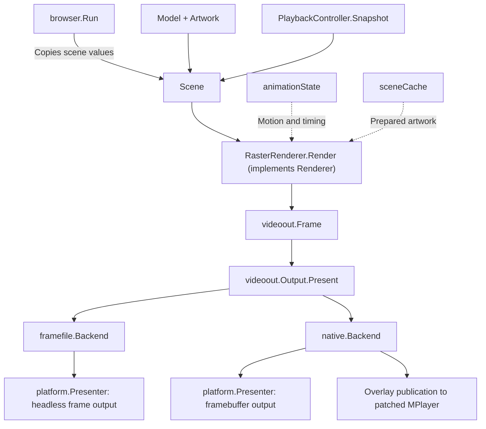

# Playback controller and rendering

`PlaybackController` is a concrete Go struct in `internal/browser/playback_controller.go`. It owns the current item, active and pending decoder resources, seek debounce, cancellation, pause restoration, and playback notices. `browser.Run` sends actions, timer ticks, and typed decoder events to the controller. It retains navigation, artwork loading, photo navigation, and music queue selection.

The browser submits every screen through `videoout.Output.Present(Frame)`. It has no direct `platform.Display` dependency. The selected backend handles browsing, video composition, and loading fallback.

`cmd/misterfin-go/main.go` selects both the renderer and output backend. `browser.Run` depends on `Renderer` and `videoout.Output`. It constructs a `Scene`, asks the renderer for pixels, and presents them. It retains event handling, frame pacing, and the request to refresh paused video when an overlay changes. It does not implement animation or call concrete drawing functions.

## Renderer contract

`Renderer.Render(width, height, Scene)` accepts positive logical dimensions and returns `videoout.Frame`. A renderer owns its animation, caches, and frame storage. It must not perform network/device I/O or change navigation. Calls are serial. Returned pixels are borrowed until the next render call, so the caller must present or copy them first.

`Scene` copies the current view and scalar UI values instead of exposing `Model` or `PlaybackState`. It also carries artwork, status text, time, and one `PlaybackPresentation` shared by photo, music, and video drawing. Position, pause state, and control visibility are not duplicated in `Scene`. The current view still borrows Jellyfin item slices and detail pointers for the synchronous call. This is a read-only boundary, not a deep immutable snapshot for asynchronous rendering. Artwork is immutable after publication and may be retained for caching.

`RasterRenderer` implements the shared pixel renderer. `animationState` owns selection easing and marquee timing. `sceneCache` owns prepared artwork. Reusable UI and overlay canvases are invalidated together when geometry changes. A replacement raster renderer can implement `Renderer` and be injected at application assembly without changing browser navigation or output backends.

The output split remains downstream of shared UI drawing. Ghostty composites clean decoder frames and UI in its backend. MiSTer publishes UI overlays while MPlayer owns the display and presents browser/loading frames itself otherwise. The optional companion backend supports a separate player window.

## Presentation contract

`videoout.Frame` contains a full BGRX `UI` frame, a straight-alpha BGRA `Overlay`, and a `Video` flag. `Video` expresses UX intent and stays true while loading or seeking, even when no decoder owns the display. The backend borrows pixel slices for the duration of `Present`. `Output.Geometry()` supplies the layout dimensions.

For browsing, photos, and music, each backend presents `UI` through its internal `platform.Presenter`. During video playback, the Ghostty `framefile` backend reads clean frames from its decoder file and composites `Overlay`. If no valid frame exists, it uses black. The native backend publishes the overlay for patched MPlayer while the decoder owns the framebuffer. Between decoder owners, the native backend presents the overlay over black itself. The companion backend composites the overlay over `UI` while a separate player window displays video.

`Acquire` and `Release` track external decoder ownership inside the backend. `Clear` discards stale playback output before a new item and after playback ends. The application creates the backend once and closes it before closing the underlying display. Backends accept `platform.Presenter`, which exposes only geometry and presentation. `platform.Display` adds `Close` for the application that owns the device. A new presenter can therefore implement pixel delivery without pretending to own display resources. The browser does not select a display path per frame.

## Source map

Each backend lives in its own subpackage and exports `New` and a concrete `Backend` type implementing `videoout.Output`. The shared `videoout` package has no dependency on its implementations. Application wiring selects the implementation.

- [`main.go`](../cmd/misterfin-go/main.go): output backend selection and application wiring.
- [`run.go`](../internal/browser/run.go): event loop, scene assembly, frame pacing, and the single presentation call.
- [`scene.go`](../internal/browser/scene.go): read-only rendering input and model-to-scene conversion.
- [`renderer.go`](../internal/browser/renderer.go): replaceable renderer interface.
- [`raster_renderer.go`](../internal/browser/raster_renderer.go): concrete renderer and frame-buffer ownership.
- [`animation.go`](../internal/browser/animation.go): per-renderer motion and title timing.
- [`render.go`](../internal/browser/render.go): browser and video overlay drawing.
- [`scene_cache.go`](../internal/browser/scene_cache.go): prepared artwork cache.
- [`output.go`](../internal/videoout/output.go): `Frame` and the shared `Output` interface.
- [`frame_file.go`](../internal/videoout/framefile/frame_file.go): Ghostty frame-file backend and video composition.
- [`native.go`](../internal/videoout/native/native.go): MiSTer backend, framebuffer ownership, and overlay publication.
- [`companion.go`](../internal/videoout/companion/companion.go): companion UI backend for a separate player window.
- [`display_linux.go`](../internal/platform/display_linux.go): framebuffer and headless presentation through the C adapter.
- [`ghostty_harness.py`](../tools/ghostty/ghostty_harness.py): terminal presentation of headless frames.
- [`video_player.py`](../tools/ghostty/video_player.py): libmpv decoding and publication of clean video frames.
- [`playback_controller.go`](../internal/browser/playback_controller.go): controller ownership, item lifecycle, input actions, and player commands.
- [`playback_seek.go`](../internal/browser/playback_seek.go): seek phases, debounce, retargeting, replacement launch, handoff, and failure recovery.
- [`playback_event.go`](../internal/browser/playback_event.go): decoder event types and dispatch, position updates, and completion handling.
- [`playback_driver.go`](../internal/browser/playback_driver.go): external-player launch, callbacks, and the dedicated decoder event channel.
- [`playback_process.go`](../internal/browser/playback_process.go): decoder resources, cancellation, start gate, and completion wait.
- [`playback_state.go`](../internal/browser/playback_state.go): shared UI state, menu visibility, destination accumulation, and loading or buffering labels.
- [`playback_presentation.go`](../internal/browser/playback_presentation.go): pointer-free rendering snapshot and its construction.

The controller methods span lifecycle, seeking, and event files because those responsibilities have distinct transitions. The smaller state, process, and presentation types each live with their methods.

A seek starts with a destination preview and a 0.5-second deadline. When the deadline expires, `seekPreparing` captures the user's pause preference, pauses the original decoder if needed, and prepares a replacement. A ready replacement waits behind a start gate until the original decoder ends. Further arrow presses cancel the replacement and enter `seekRetargeting`, which shows the destination again and renews the deadline without overwriting the original pause preference. The controller opens the gate only after preparation succeeds and the original decoder has released its output. Position feedback then restores the user's pause preference.

## Controller contract

- `Start(item, offset, paused, now)` starts an item and resets its playback UI state. An explicit zero offset implements SELECT restart.
- `Key(action, now)` handles pause, control toggling, video seek, and stop. The browser handles music track selection separately.
- `Tick(now)` starts a pending seek after the half-second deadline. Retargeting cancels the obsolete replacement and restarts that deadline.
- `Handle(event, now)` applies decoder feedback. It returns true when the active item ends and the browser must handle navigation or track advancement. Seek handoffs and stale decoder events do not end the item.
- `Snapshot(now)` returns display information without mutable pointers, decoder handles, navigation state, or output-specific flags.
- `Refresh()` asks the active player to refresh its paused output. The output adapters remain responsible for pixel presentation.
- `StopForTrackChange()` stops the current decoder without treating the stop as a user exit from playback.
- `Close()` cancels and waits for the tracked active and pending decoders.

`PlaybackEvent` identifies the decoder and one event kind: prepared, position, paused, buffering, or ended. Each `playbackProcess` groups its identifier, cancellation function, completion channel, asynchronous cleanup signal, preparation gate, and readiness flag. A `playbackLaunch` function connects the controller to real decoding. Tests supply a deterministic function that records launch requests and cancellation.

The controller has no dependency on `platform`, `videoout`, terminal input, fonts, or canvas drawing. `playbackDriver` wires `AcquireVideo` and `ReleaseVideo` callbacks to the selected output adapter. It sends `PlaybackEvent` values through a dedicated channel directly to the browser loop. Decoder feedback no longer shares the browsing and artwork result queue or allocates an event pointer per update. Progress can be dropped when the decoder event queue is full. Lifecycle events wait for delivery unless the application is shutting down.

## Presentation and remaining coupling

`PlaybackPresentation` carries title, position, duration, seek destination, pause state, control visibility, wait label, and notice. `renderVideoOverlay` accepts the snapshot and time for animation. It no longer inspects the browser view stack or Jellyfin item.

`PlaybackState` groups the existing media UI fields. The controller creates it, and `Model` embeds a pointer to the same state so existing music rendering and photo control reveal behavior continue to work. The browser event loop is the sole writer. Music queue completion still clears `PlayingAudio`, and photo actions still use the shared control timer. This is an explicit remaining coupling, not an immutable model boundary for every screen.

The first extraction preserves the existing notice behavior. Notices are available in the snapshot, but the video overlay does not yet draw them. Shared layout geometry, pixel formats, headless cgo usage, and frame transport are unchanged. The output interface now carries both browser and playback frames.

## Validation

Controller tests use explicit times and simulated decoder events. They cover the half-second debounce, destination-to-seeking transitions, retargeting during old-decoder shutdown, immutable request offsets and snapshots, stale feedback, pause restoration, seek failure, Back cancellation, control expiry, and Live TV seek exclusion. Ghostty integration tests continue to exercise the real event loop and player bridge, including restart followed by a slow seek, music track changes, photos, and returning to the channel list.

Output tests cover normal browser frames, loading before decoder acquisition, handoff after release, return to browsing, stale video files, composition, and native overlay publication.

## MiSTer drawing performance

On September 12, 2026, `BenchmarkBackdrop` measured scaling a 1280×720 RGBA backdrop to 640×240 and shading it on the MiSTer ARM CPU. The original path took approximately 141 ms per operation and allocated 614403 bytes across 153600 allocations. Direct RGBA pixel access plus a shading lookup table reduced that to approximately 19 ms and 2688 bytes in one allocation. This benchmark measures drawing work, not complete menu latency or framebuffer presentation. Pixel comparisons cover transparency, clipping, subimages, and shading.

Run the benchmark with `go test ./internal/ui -run '^$' -bench BenchmarkBackdrop -benchmem`. For hardware measurement, cross-compile that package with `go test -c` and run the test binary on MiSTer.

## Visual parity review

The September 12 comparison used `src/main.c` and `src/draw.c` from the preserved merged C baseline. List backdrops now occupy the top three quarters of the logical screen, preserving their physical 16:9 shape, with the baseline's 110/255 brightness fading to black. Header marquees run at 15 pixels per second and restart when the screen title changes. The header uses a 16-row scratch canvas instead of allocating another full frame.

Runtime labels use hours once duration reaches one hour. Artist, album, and series rows omit missing counts and use singular labels for one item. Album rows omit missing years. Detail ratings follow the year when present and start at the left margin otherwise. Both channel type names use the same channel-number formatting. Regression tests cover PAL/NTSC backdrop bounds, metadata, duration formatting, and marquee clipping.

Remaining visual gaps include music visualizers and VU meters, animated setup screens, Continue Watching and Next Up cards, About/update screens, and advanced playback menus. Some require data or playback features as well as drawing. The maintainer's requested photo/music navigation, clean pause behavior, and shared loading/seeking overlay remain intentional Go UX requirements.

## Prepared artwork and frame pacing

`RasterRenderer` owns reusable browser and overlay frames, animation state, and `sceneCache` on the event loop. List backdrops and cover panels are composed once per image/geometry change. Detail backdrops and gradients are also cached. Carousel artwork is resized and shaded into row strips once, then scrolling copies a different window from each strip. Text, selection, clocks, and controls remain dynamic.

The cache retains one prepared background and one carousel set. It compares immutable RGBA image identities, screen geometry, and tile aspect. It rebuilds when those inputs change. Unknown image implementations bypass reuse. Returned frame pixels are borrowed until the next draw, matching the synchronous output contract. Standalone `render` calls keep the uncached path for independent captures and pixel comparisons.

Complete-frame `BenchmarkBrowserFrame` measurements on the MiSTer ARM CPU were approximately 19.2 ms for a list and 36.9 ms for a carousel before caching. After caching, both measured approximately 3.0 ms. Per-frame allocations dropped from approximately 659–666 KB to 43 KB. These benchmarks exercise drawing with prepared local artwork, including animated positions. They exclude network loading, framebuffer vsync/copy, and physical input latency. First draws after cache invalidation still prepare artwork.

Browser animations now request updates at 60 Hz, matching the C carousel timeline. Video overlays retain 30 Hz polling. The native MPlayer adapter retains clean decoded pixels in RAM and blends the latest overlay before writing each framebuffer row. The overlay remains present on every video frame, even when the UI has not changed. The native player retains the C adapter’s vsync wait in the decode path, before MPlayer schedules presentation. Video backdrops are cached instead of rescaled at the overlay update rate. Hardware framebuffer presentation still waits for vsync, so the physical display determines the achieved cadence. Pixel comparisons pass on MiSTer for cached versus fresh frames across animation, image replacement, transparency, subimages, and PAL/NTSC geometry changes.

Renderer contract tests cover copied scalar state, complete browser/video frames, overlay clearing, geometry changes, and animation timing. Output tests use a presenter with no `Close` method to verify the narrower backend dependency.

After renderer injection, the benchmark calls `Renderer.Render`, including scene-driven animation and frame assembly. MiSTer measured approximately 3.2 ms per list/carousel frame, with two allocations per frame. Hardware renderer contract tests passed. The small difference from the earlier 3.0 ms draw-only measurement does not establish a change in input-to-display latency.

Video playback must have access to both MiSTer CPU cores. Main_MiSTer pins Scripts to CPU 1, so the Go launcher widens affinity before starting the application and its decoder. A captured 29.97 fps episode sample reproduced about 2.3 seconds of A/V drift under competing work on CPU 1. The same test with both cores available stayed synchronized with no dropped frames. Decoder startup must inherit the wider mask. Changing affinity after drift accumulated did not recover the failing session. Backdrop identity checks include JPEG `*image.YCbCr` and PNG `*image.NRGBA` images as well as `*image.RGBA`, so playback does not repeat image scaling at every UI tick.
